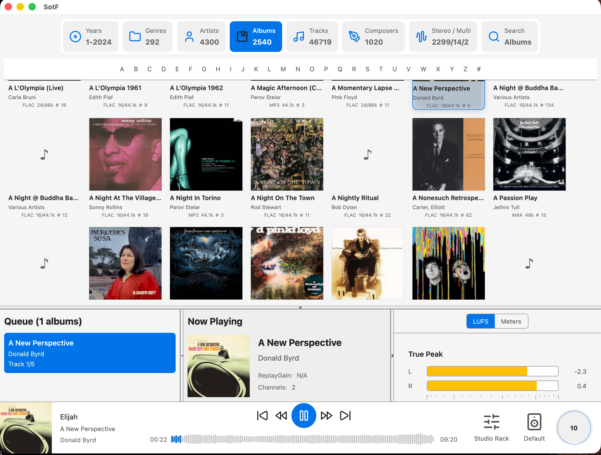
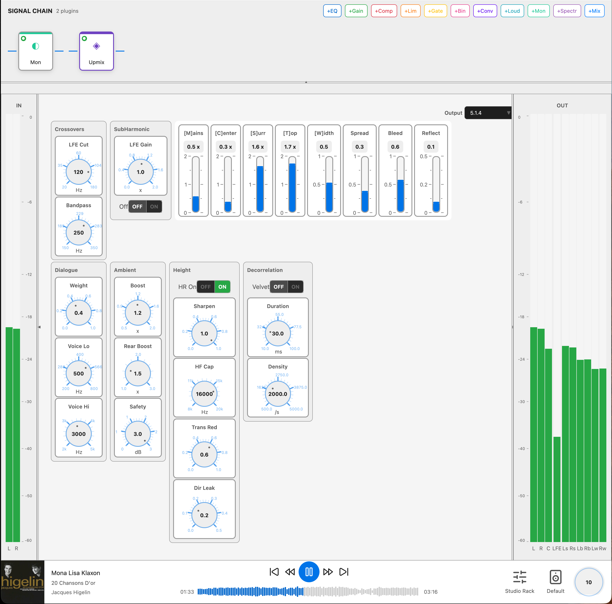

<!-- markdownlint-disable-file MD013 -->

# SotF: an automatic eq for your speakers or headsets

The software helps you to get better sound from your speakers or your headsets. It can run as a TUI app (in a terminal) or a classical UI.
What can you do with it?
- play music :)
- add audio plugins to customise the experience, an EQ, an upmixer for spatial audio or a binaral rendered? a limiter or a compressor?
- create an EQ for your headphone!
- create an EQ for anechoic speaker measurements that you find on AudioScienceReview or ErinsAudioCorner (among others)
- create an room optimiser for your room, from simple to use to you are in control of every steps: a state of the art optimiser.
- compare one EQ with another. Customise to taste. Which one do you prefer?

*Sound of the Future* or *SotF* in short comes from the song from [Giorgio Moroder](https://en.wikipedia.org/wiki/Giorgio_Moroder) made popular by [Daft Punk](https://en.wikipedia.org/wiki/Daft_Punk). You can find many versions on Youtube. Here is an [official one](https://youtu.be/zhl-Cs1-sG4?si=H4hgakoEdQn-HMH6&t=73).

## A picture is worth a thousand words.

### Player



## How to use?

Download a release from our [repo](https://github.com/pierreaubert/sotf) on Github. If you like it, star the directory please. If you dont, please let us know why? All feedback is welcome: you can leave a comment on [github](https://github.com/pierreaubert/sotf/discussions/116) or on [AudioScienceReview](https://www.audiosciencereview.com/forum/index.php?threads/autoeq-for-speaker-and-headphone.66460/).

## Install

### Cargo

Install [rustup](https://rustup.rs/) first.

If you already have cargo / rustup, you can jump to:

```shell
cargo install just
just
```

On Linux or MacOS, select the correct install just command for your platform:
```shell
just install-...
```
On Windows,
```shell
.\sotf-audio-player\windows\build-windows.bat
```

Then run post-install
```shell
just post-install
```

You can build or test with a simple:
```shell
just build
just test
```

In order to build the TUI version
```shell
just sotf-tui
```
and for the UI version:
```shell
just SotF
```

## Where is the code?

The code is in 3 parts:
- [math-audio](https://github.com/pierreaubert/math-audio) : a toolkit for DSP processing, FEM and BEM simulations
- [autoeq](https://github.com/pierreaubert/autoeq) : a toolkit for generating EQ from measurements (IIR, FIR, MSO, DSO etc)
- this repository [sotf](https://github.com/pierreaubert/sotf) which is mostly the UI and TUI. It also as a GPUI toolkit with components and plots (see below).

Why did you not reuse more code? The goal was to learn Rust and to learn other things I always wondered about:
- How to write an audio player? I took inspiration from camilladsp and wrote my own. I could have use Camilla (and I did at the beginning)
- Why are plotting library never perfect? I can usually go 90% of the way with most libraries but then I get block and then it gets complicated to get exactly what you want.
- Can I do everything in Rust from backend to fronted? I am not a fan of Typescript and the context switching between Rust and Typescript is not ideal for me. Using GPUI allow me to stay in Rust and be concentrated.
- Did LLM model progress enough to help building a complex app? Answer is yes since Opus 4.5 and Gemini 3.0.
- Can I reuse my old c++ code with audio plugin? Answer is also yes, I translated most of them in Rust now. I am still unclear if I will be able to build AU plugins with GPUI but it is working for CLAP and VST3.

## Toolkit

### GPUI support

#### gpui-ui-kit

A set of components to make it easier to develop UI. See the showcase application to see what is available.

```shell
just demo-ui-kit
```
or
```shell
cargo run --release --example showcase -p gpui-ui-kit
```

Status: ok

#### gpui-d3rs

A port of the famous d3js library in rust with support for the GPU. You get a similar library but dont need a web-browser.
See the showcase application :
```shell
cargo run --release --bin d3rs-showcase --features="gpui"
```
and the spinorama demo:
```shell
cargo run --release --bin d3rs-spinorama --features="spinorama, gpu-3d"
```

Status: ok, not everything is GPU accelerated yet!

#### gpui-px

A high level plotting library similar to plotly express.
See the showcase application :
```shell
cargo run --release --bin px-showcase
```

Status: getting ok, not everything is GPU accelerated yet!

#### gpui-au

A bridge to allow building AUv3 plugins with the rust audio engine. It does not work *yet* with the frontend part of the plugin.

Status: experimental

#### gpui-themes

A theme editor

Status: experimental

### sotf-audio-*

This backend take care of all the Audio activities (from recording to playing). It also provides support for IIR filters, SPL computations etc.

It does provide a lot of features:
- playing:
  - reading from files and audio interfaces
  - computing relay gain, spectrum, lufs etc
- recording:
  - record from N channels
  - play test signals and record on N channels or N times on 1 channel automatically
  - microphone compensation
- plugins:
  - gate
  - limiter
  - compressor
  - eq (iir)
  - convolver (fir)
  - delay
  - crossover (via iir)
  - loudness compensation (via iir)
  - upmixer up to 9.1.6
  - binaural decoder

It does have interfaces to demonstrate how the system works:
- There is a basic CLI
- There is a fun TUI interface that is good enough to use day to day to play music
- A better looking interface is in construction on src-gpui-player but not ready for general use at all.

Status:
- sotf-audio-engine: production quality
- sotf-audio-plugins: code is good but some plugins need tuning.
- sotf-audio-plugins/src-ffi: beta quality
- gpui-au: a bridge between AUv3 plugin and gpui
- sotf-audio-player: production quality
- sotf-audio-player/app-tui: good quality, can scan by 4k albums and play them with an TUI interface. It is good for testing parameters and plugins.
- sotf-audio-player/app-gpui: experimental status


### MacOS specific: sotf-macos-hal

sotf-macos-hal crate builds a HAL (Audio Driver on MacOS) such that you can redirect all your music to this driver and benefit from corrected sounds all the time.

Status: experimental for HAL and ok for confbar.

## More pictures

### Upmixer



