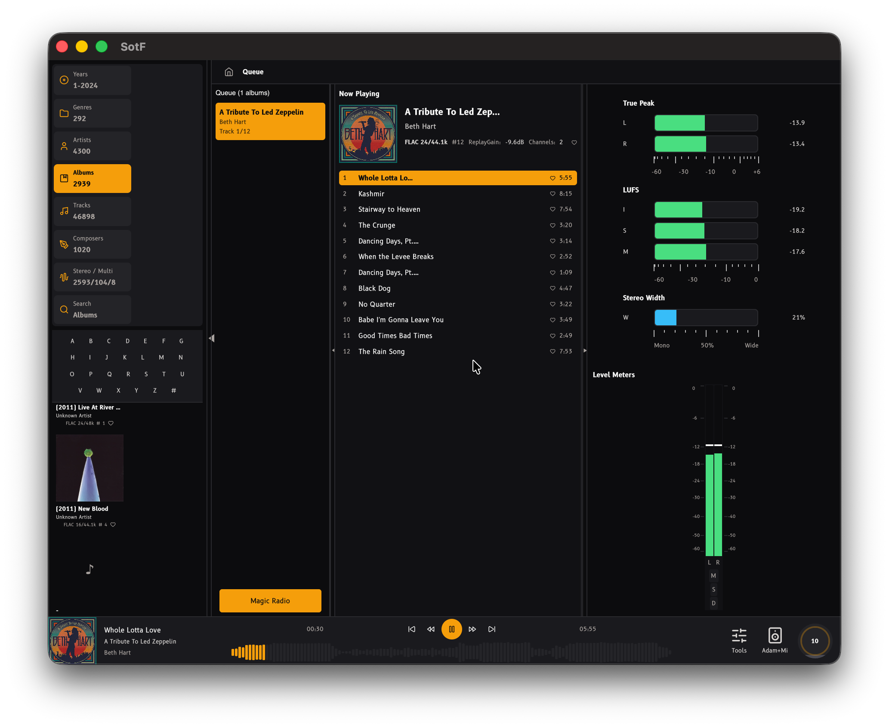
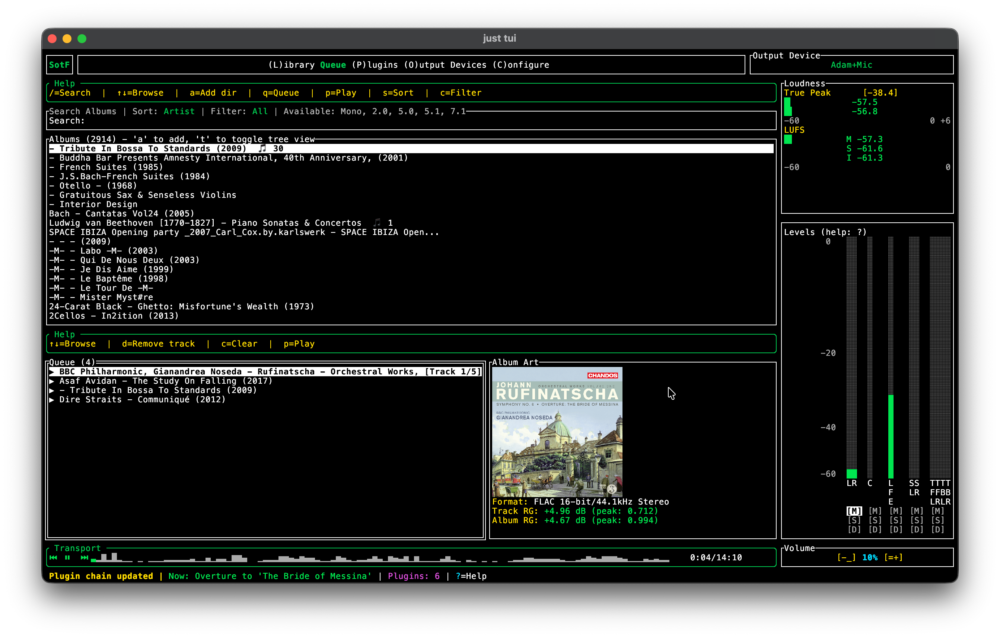
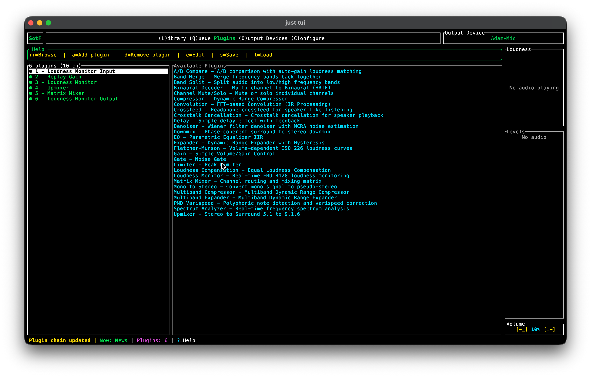
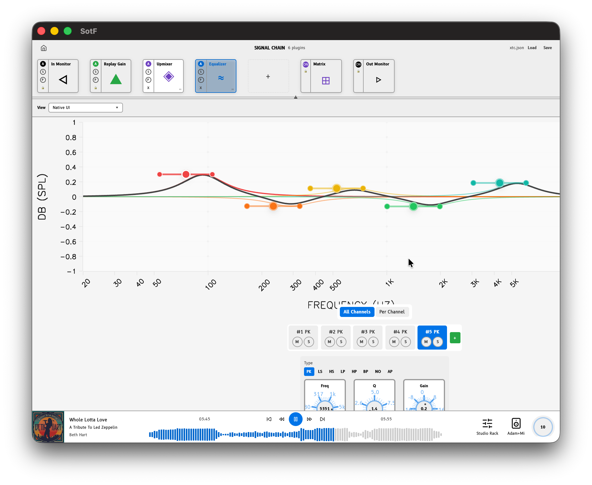
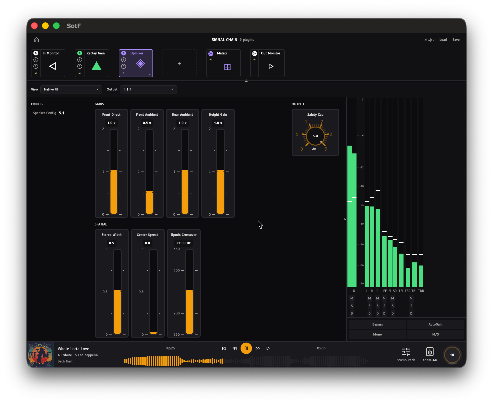
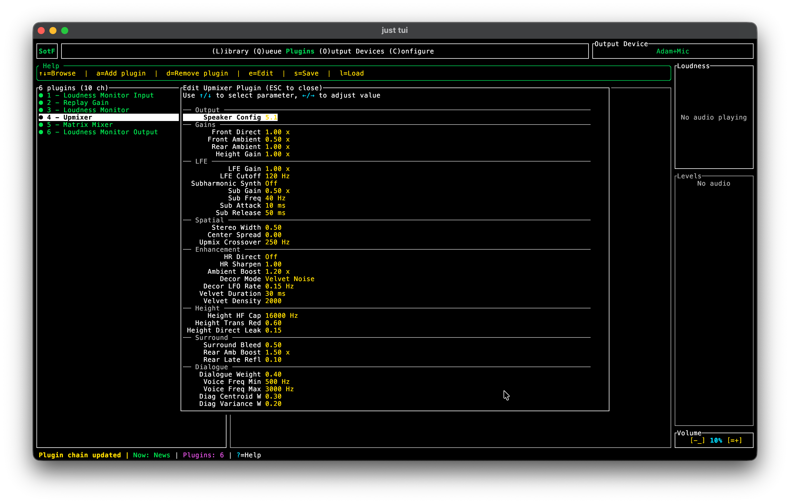

<!-- markdownlint-disable-file MD013 -->

# SotF: an automatic eq for your speakers or headsets

The software helps you to get better sound from your speakers or your headsets. It can run as a TUI app (in a terminal) or a classical UI.
What can you do with it?
- play music :)
- add audio plugins to customise the experience, an EQ, an upmixer for spatial audio or a binaural rendered? a limiter or a multiband compressor? a denoiser?
- create an EQ for your headphone!
- create an EQ for anechoic speaker measurements that you find on AudioScienceReview or ErinsAudioCorner (among others)
- create an room optimiser for your room, from simple to use to you are in control of every steps: a state of the art optimiser.
- compare one EQ with another. Customise to taste. Which one do you prefer?

*Sound of the Future* or *SotF* in short comes from the song from [Giorgio Moroder](https://en.wikipedia.org/wiki/Giorgio_Moroder) made popular by [Daft Punk](https://en.wikipedia.org/wiki/Daft_Punk). You can find many versions on Youtube. Here is an [official one](https://youtu.be/zhl-Cs1-sG4?si=H4hgakoEdQn-HMH6&t=73).

## A picture is worth a thousand words.

### Native Player



### Terminal Player



## How to use?

- Windows: [download from Microsoft Store](https://apps.microsoft.com/detail/9NXCMV37NXJ7).
- Apple: [download from the Apple Store (soon: certification ungoing)]()

Latest versions are on our [repo](https://github.com/pierreaubert/sotf) on Github and there is another copy on our [website](https://sotf.spinorama.org).

If you like it, star the directory please. If you dont, please let us know why? All feedback is welcome: you can leave a comment on [github](https://github.com/pierreaubert/sotf/discussions/116) or on [AudioScienceReview](https://www.audiosciencereview.com/forum/index.php?threads/autoeq-for-speaker-and-headphone.66460/).

### Main functions

- An **audio player** (nothing special but useful to have bundle with the other applications)
- A **audio recorder** to measure your speakers
- A system to **optimise** the sound based on your measurements for speakers and from internet measurements for headset. We claim to have a SOTA optimiser (a bit early for it but improving month after month if you want to a engineer view of it).
- A large set of audio plugins that do spatial audio, binaural, denoiser, limiter, compressor, upmixer, equalizer, room optimiser, etc.
- A systemwide DSP that allow you to run the roomEQ system continously for all applications on your computer. Currently working well on MacOS and needs to be ported/tested on Linux and Windows.

The main UI application shows you the audio player. You can access the other functions via the menu bars.

## For developpers

This is mainly a Rust application with some python and shell scripts. We want to keep it portable so we minimise C/C++ dependencies.

### Cargo

Install [rustup](https://rustup.rs/) first.

If you already have cargo / rustup, you can jump to:

```shell
cargo install just
just
```

On Linux, select the correct install just command for your platform:
```shell
just install-...
```

On MacOS, select the correct install just command for your platform:
```shell
just install-macos
```
On Windows,
```shell
.\scripts\build-windows.bat
```

Then run post-install:
```shell
just post-install
```

Then download various data files
```shell
just download-once
```

You can build or test with a simple:
```shell
just build
just test
```

For QA there is a
```shell
just qa
```
that takes some time to run.

In order to build the audio player, we have 3 versions: a cli (command line interface), a tui (terminal UI) and a desktop.
```shell
cargo build --bin player-cli --release -p app-cli
just tui
just gpui
```
Since it is a rust stack, the binaries are generated in `target/release/` directory and you can execute them from there.

In order to build signed binaries (required on MacOS):
If you are a developper, you can self sign them with
```shell
./scripts/build-systemwide.sh
./scripts/build-dmg-sotf.sh
```

In order to publish them, you need to have an Apple developper ID:
```shell
./scripts/build-systemwide.sh --sign --notorized
./scripts/build-dmg-sotf.sh --sign --notorized
```

## Where is the code?

The code is in four parts:

### SotF

This repository [sotf](https://github.com/pierreaubert/sotf) which is mostly an audio backend and the UI and TUI. The backend audio has a few components:

- an [audio engine](crates/engine/README.md) : an audio engine (process streams or files and output pcm to your audio device)
- an [audio player](crates/player/README.md): a library doing track management and 3 players, a CLI for testing, a TUI (terminal) based one and a desktop one with a native UI.
- a set of audio [plugins](crates/plugins/README.md):

  - host: a mini DAW that can run plugins in a list (like a rack) or in a graph (like a DAW) visualisation: loudness, spectrum, lufs
  - classical: iir and fir EQ, compressor (and multi-band compressor), limiter, gain, matrix, resampler, multi-band expander, convolution, delay, crossover, loudness compensation
  - spatial: upmixer from 2.0 to 9.1.6, binaural, cross-talk cancelation, mono to stereo, dowmixer.
  - denoiser, declicker, polyphonic note detection
  - a/b testing

### Math related audio toolkit

#### math-testfunctions

A [set of functions](math-test-functions/README.md) for testing non linear optimisation algorithms used in the next crate.

#### math-optimisation

A implementation of [differential evolution algorithm](math-optimisation/README.md) (forked from Scipy) with an interface to NLopt and MetaHeuristics two libraries that also provide various optimisation algorithms. DE support linear and non-linear constraints and implement other features like JADE or adaptative behaviour.

Status: good for speaker equalisation. Not tested enough for other use cases.

#### math-iir-fir

An [IIR and FIR filters](./crates/math-iir-fir/README.md) implementation in Rust. Does what you expect. Compatible with Equalizer APO. It can generate various output formats.

Status: stable and working well.

#### math-dsp

A [DSP library](./crates/math-dsp/README.md) implementing test signals and fft based analysis.

Status: new.

#### math-solvers

A set of [classical solvers](./crates/math-solvers/README.md) with preconditionners that use LAPACK, BLAS and rayon for parallelisation. Support sparse matrices.
Also can work in WASM which is convenient for web demos.

Status: correct and relatively fast but not optimised to death. WASM needs rust nightly to run in parallel.

#### math-wave

A set of functions to compute [known analytical solutions of the wave equation](./crates/math-wave/README.md).

Status: correct.

#### math-xem-common

Implement BEM and FEM for the Helmotz and wave equations. Support multigrid for both systems. XEM holds the common code.

Status: unknown, results match analytical results on simple mesh. Needs more testing especially for the advance features.

#### math-convexhull3d

This crate computes a [convex hull in 3d](./crates/math-convexhull3d/README.md).

Status: good quality aka no known bug.

#### math-bem

This crate implements a BEM (Boundary Element Method) solver, see [BEM README](crates/math-bem/README.md)

Status: ok-ish

#### math-fem

This crate implements a FEM (Finite Element Method) solver, see [FEM README](crates/math-fem/README.md)

Status: ok-ish


### Automatic EQ

#### autoeq

[Main crate](./crates/autoeq/README.md) with CLI binaries and optimization logic: it allow to optimise the sound from:
- [autoeq](./crates/autoeq/README.md): optimise anechoic data for speakers and data from a headphone
- convert-recording: automatically migrate old recordings to latest format.
- [roomeq](./crates/autoeq/bin/roomeq/README.md): optimise a set of speakers in room. The [input](./crates/autoeq/bin/roomeq/INPUT_FORMAT.md) and [ouput](./crates/autoeq/bin/roomeq/OUTPUT_FORMAT.md) formats are documented.

#### autoeq-cea2034

[CEA2034/Spinorama](./crates/autoeq-cea2034/README.md) calculations (listening window, early reflections, predicted in-room response, speaker scores)

#### autoeq-roomsim

WASM-targeted [room acoustic simulator](./crates/autoeq-roomsim/README.md) using BEM (boundary element method)

#### autoeq-datagen

Generate room data from the FEM and BEM package to test roomEQ.


### GPUI toolkit

#### gpui-ui-kit

A comprehensive UI component library with 40+ components including:
- **Core**: Button, Card, Dialog, Menu, Tabs, Toast
- **Forms**: Input, NumberInput, Checkbox, Toggle, Select, Slider, ColorPicker
- **Data Display**: Badge, Progress, Spinner, Avatar, Typography
- **Audio Controls**: Potentiometer, VerticalSlider, VolumeKnob

See the [gpui-ui-kit README](./crates/gpui-ui-kit/README.md) for usage examples.

#### gpui-d3rs

A port of D3.js concepts to Rust with idiomatic builder patterns:
- **Scales**: Linear, Log with automatic tick generation
- **Shapes**: Lines, Bars, Areas, Arcs, Pies, Scatter plots
- **Colors**: RGB/HSL, interpolation, categorical schemes
- **Geographic**: Mercator, Orthographic projections
- **Spatial**: QuadTree, Delaunay triangulation, Voronoi
- **Animation**: Transitions, easing functions, timers

See the [gpui-d3rs README](./crates/gpui-d3rs/README.md) for the full feature list and examples.

### gpui-px

High-level charting API inspired by Plotly Express:
- 6 chart types: Scatter, Line, Bar, Heatmap, Contour, Isoline
- Fluent builder API
- Color scales: Viridis, Plasma, Inferno, Magma, Heat, Coolwarm
- Logarithmic scale support

See the [gpui-px README](./crates/gpui-px/README.md) for quick start examples.


## FAQ

Why did you not reuse more code? The goal was to learn Rust and to learn other things I always wondered about:

- How to write an audio player? I took inspiration from camilladsp and wrote my own. I could have use Camilla (and I did at the beginning)
- Why are plotting library never perfect? I can usually go 90% of the way with most libraries but then I get block and then it gets complicated to get exactly what you want.
- Can I do everything in Rust from backend to fronted? I am not a fan of Typescript and the context switching between Rust and Typescript is not ideal for me. Using GPUI allow me to stay in Rust and be concentrated.
- Did LLM model progress enough to help building a complex app? Answer is yes since Opus 4.5 and Gemini 3.0. It is of course not perfect.
- Can I reuse my old c++ code with audio plugin? Answer is also yes, I translated most of them in Rust now. I am still unclear if I will be able to build AU plugins with GPUI but it is working for CLAP and VST3. I also get the plugins to work as AUplugin with some hacking and a bit of Swift.

### MacOS specific: daemon and driver-hal

On MacOS the sound managent system does not make it easy to route audio between applications.

We added a few components:
- driver-hal: a HAL (Hardware Abstraction Layer) to route audio between applications. It is similar to BlackHole (https://github.com/BlackHoleSound/BlackHole) but it allow to route the audio through a DAW with plugins.
- daemon: a Rust deamon software that read audio from the HAL driver, apply a chain of plugins (typically to correct the sound of your headphone or software) and then send it to a hardware audio interface.
- toolbar: a software that allow to configure the daemon and HAL driver. It sits in the macos toolbar.

Status: almost working.

## More pictures

### Plugins list



### EQ



### Upmixer




