# gpui-ui-kit

A reusable UI component library for [GPUI](https://github.com/zed-industries/zed) applications.

Provides composable, styled UI components with consistent theming for building desktop applications with the GPUI framework.

## Showcase

First app built with gpui-ui-kit is [SotF](https://github.com/pierreaubert/sotf).

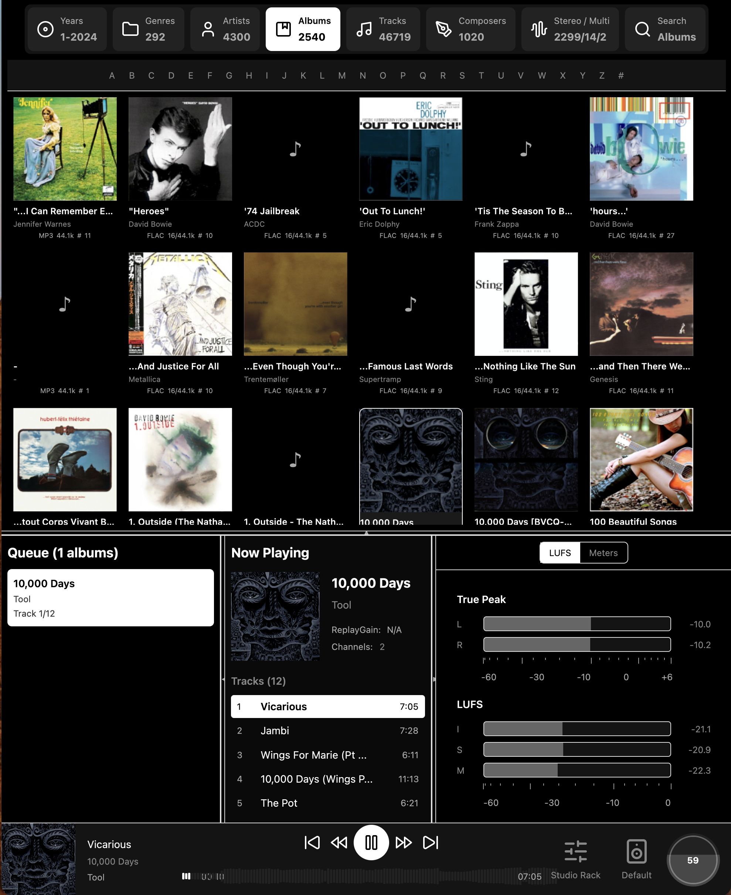

## Installation

Add to your `Cargo.toml`:

```toml
[dependencies]
gpui-ui-kit = { version = "0.6.12", git="https://github.com/pierreaubert/sotf/tree/master/crates/gpui-toolkit/gpui-ui-kit" }
```

## Components

### Core Components

| Component | Description |
|-----------|-------------|
| `Button` | Styled button with variants (Primary, Secondary, Destructive, Ghost, Outline) |
| `IconButton` | Icon-only button with hover states |
| `Card` | Container with optional header, content, and footer sections |
| `Dialog` | Modal dialog with backdrop, title, and customizable size |
| `Menu` / `MenuBar` | Navigation menus and menu bars |
| `ContextMenu` | Right-click context menu with positioned backdrop and click-outside dismiss |
| `Popover` | Floating panel with 8 placement options, backdrop dismiss, and theme factory |
| `ConfirmDialog` | Confirmation prompt with Default/Destructive/Warning variants |
| `Tabs` | Tabbed navigation with Underline, Enclosed, and Pills variants |
| `Toast` / `ToastContainer` | Notification toasts with positioning |

### Form Components

| Component | Description |
|-----------|-------------|
| `Input` | Text input with label, placeholder, validation, mouse drag selection, clipboard (Cmd+C/V/X), and Emacs keybindings |
| `NumberInput` | Numeric input with +/- buttons, min/max bounds, step size, scroll wheel support, and keyboard navigation |
| `Checkbox` | Checkbox with label and indeterminate state |
| `Toggle` | Toggle switch |
| `Select` | Dropdown select with options |
| `ButtonSet` | Grouped button options for single selection |
| `ColorPicker` | Color picker with palette and custom color input |
| `Slider` | Horizontal slider with value display |
| `Wizard` | Multi-step wizard with navigation and step validation |

### Data Display

| Component | Description |
|-----------|-------------|
| `Badge` / `BadgeDot` | Status badges with variants |
| `Progress` / `CircularProgress` | Progress bars and circular indicators |
| `Spinner` / `LoadingDots` | Loading indicators |
| `Avatar` / `AvatarGroup` | User avatars with status indicators |
| `Table` | Data table with sorting, selection, and pagination |
| `QrCode` | QR code display with custom size, foreground, and background colors |
| `KeyboardShortcutLabel` | Renders keyboard shortcuts as styled key caps (e.g., `⌘+K`) |
| `EmptyState` | Placeholder for empty lists/containers with icon, title, description, and action |
| `Text` / `Heading` / `Code` / `Link` | Typography components |

### Feedback

| Component | Description |
|-----------|-------------|
| `Alert` / `InlineAlert` | Contextual feedback messages (Info, Success, Warning, Error) |
| `SearchBar` | Search input with icon, clear button, and size variants |
| `Tooltip` | Hover tooltips with placement options |

### Layout

| Component | Description |
|-----------|-------------|
| `VStack` / `HStack` | Vertical and horizontal stack layouts |
| `Spacer` | Flexible spacer element |
| `Divider` | Horizontal/vertical dividers with optional interactivity |
| `PaneDivider` | Resizable pane divider for split views |
| `Sidebar` | Collapsible side panel with left/right positioning, header, footer, and scrollable content |
| `StatusBar` | Horizontal bar with left/center/right sections for top or bottom of window |
| `Accordion` | Collapsible content panels |
| `Breadcrumbs` | Navigation breadcrumbs |

### Audio Controls

Audio-specific controls and visualizations live in the sibling
`gpui-audio-kit` crate. Import `Potentiometer`, `VerticalSlider`,
`VolumeKnob`, `AudioDesignTokens`, meters, spectrum elements, and audio scale
helpers from `gpui_audio_kit`.

### Accessibility

All components support ARIA roles and labels via the `accessibility` module. Since GPUI has no native accessibility support, this stores semantic metadata in a runtime `AccessibilityTree` for tests, dev tools, and future screen reader bridges.

```rust
use gpui_ui_kit::{Button, AriaRole};

// Icon-only button with accessible name
Button::new("save-btn", "💾")
    .aria_label("Save document")

// Override default role
Button::new("link-btn", "Visit website")
    .aria_role(AriaRole::Link)

// All components auto-register with sensible defaults:
// Button -> AriaRole::Button
// Checkbox -> AriaRole::Checkbox
// Toggle -> AriaRole::Switch
// Slider -> AriaRole::Slider (with value_range)
// Select -> AriaRole::Combobox
// Dialog -> AriaRole::Dialog
// Toast -> AriaRole::Status (or Alert for errors)
```

## Usage Examples

### Button

```rust
use gpui_ui_kit::{Button, ButtonVariant, ButtonSize};

// Basic button
Button::new("btn-save", "Save")

// Primary button with click handler
Button::new("btn-submit", "Submit")
    .variant(ButtonVariant::Primary)
    .on_click(|window, cx| {
        println!("Button clicked!");
    })

// Destructive button
Button::new("btn-delete", "Delete")
    .variant(ButtonVariant::Destructive)
    .size(ButtonSize::Sm)

// Ghost button with icon
Button::new("btn-menu", "Menu")
    .variant(ButtonVariant::Ghost)
    .icon_left("☰")

// Full width disabled button
Button::new("btn-loading", "Loading...")
    .full_width(true)
    .disabled(true)
```

### Card

```rust
use gpui_ui_kit::Card;
use gpui::div;

Card::new()
    .header(div().child("Card Title"))
    .content(div().child("Card content goes here"))
    .footer(
        div().flex().gap_2()
            .child(Button::new("cancel", "Cancel").variant(ButtonVariant::Ghost))
            .child(Button::new("save", "Save"))
    )
```

### Input

```rust
use gpui_ui_kit::{Input, InputSize, InputVariant};

// Basic input with label
Input::new("email")
    .label("Email")
    .placeholder("Enter your email")

// Input with error
Input::new("username")
    .label("Username")
    .value("invalid!")
    .error("Username contains invalid characters")

// Filled variant with icon
Input::new("search")
    .variant(InputVariant::Filled)
    .placeholder("Search...")
    .icon_left("🔍")

// Input with change callback
Input::new("name")
    .label("Name")
    .on_change(|value, window, cx| {
        println!("Input changed: {}", value);
    })
```

**Input Features:**
- **Mouse drag selection**: Click and drag to select text ranges
- **Double-click**: Select all text
- **Clipboard**: Cmd+C (copy), Cmd+V (paste), Cmd+X (cut), Cmd+A (select all)
- **Emacs keybindings**: Ctrl+A (beginning), Ctrl+E (end), Ctrl+K (kill to end), Ctrl+U (kill to beginning)
- **Navigation**: Arrow keys, Home/End, Backspace/Delete

### NumberInput

```rust
use gpui_ui_kit::{NumberInput, NumberInputSize};

// Basic number input
NumberInput::new("quantity")
    .label("Quantity")
    .value(10.0)
    .min(0.0)
    .max(100.0)
    .step(1.0)

// Number input with decimals and units
NumberInput::new("frequency")
    .label("Frequency")
    .value(1000.0)
    .min(20.0)
    .max(20000.0)
    .step(10.0)
    .decimals(1)
    .unit("Hz")
    .width(120.0)
    .on_change(|value, window, cx| {
        println!("Frequency: {} Hz", value);
    })

// Compact size for dense layouts
NumberInput::new("gain")
    .value(0.0)
    .min(-12.0)
    .max(12.0)
    .step(0.5)
    .decimals(1)
    .unit("dB")
    .size(NumberInputSize::Sm)
```

**NumberInput Features:**
- **+/- buttons**: Click to increment/decrement by step size
- **Click to edit**: Click the value to enter edit mode
- **Double-click**: Select all text in edit mode
- **Scroll wheel**: Scroll up/down to adjust value
- **Arrow keys**: Up/Down to adjust value when focused
- **Bounds enforcement**: Values clamped to min/max range

### Tabs

```rust
use gpui_ui_kit::{Tabs, TabItem, TabVariant};

Tabs::new()
    .tabs(vec![
        TabItem::new("general", "General").icon("⚙"),
        TabItem::new("audio", "Audio").icon("🔊"),
        TabItem::new("video", "Video").icon("🎬").badge("New"),
    ])
    .selected_index(0)
    .variant(TabVariant::Underline)
    .on_change(|index, window, cx| {
        println!("Selected tab: {}", index);
    })
```

### Dialog

```rust
use gpui_ui_kit::{Dialog, DialogSize};
use gpui::div;

Dialog::new("confirm-dialog")
    .title("Confirm Action")
    .size(DialogSize::Md)
    .content(div().child("Are you sure you want to proceed?"))
    .footer(
        div().flex().gap_2().justify_end()
            .child(Button::new("cancel", "Cancel").variant(ButtonVariant::Ghost))
            .child(Button::new("confirm", "Confirm"))
    )
    .on_close(|window, cx| {
        // Handle dialog close
    })
```

### ContextMenu

```rust
use gpui_ui_kit::{ContextMenu, MenuItem};

ContextMenu::new("file-context-menu", vec![
    MenuItem::new("cut", "Cut").with_shortcut("⌘X"),
    MenuItem::new("copy", "Copy").with_shortcut("⌘C"),
    MenuItem::separator(),
    MenuItem::new("paste", "Paste").with_shortcut("⌘V"),
    MenuItem::new("delete", "Delete").danger(),
])
    .position(mouse_position)
    .on_select(|id, window, cx| {
        println!("Selected: {}", id);
    })
    .on_close(|window, cx| {
        // Dismiss context menu
    })
```

### Popover

```rust
use gpui_ui_kit::{Popover, PopoverPlacement};

Popover::new("device-picker")
    .placement(PopoverPlacement::BottomStart)
    .width(px(240.0))
    .content(div().child("Popover content"))
    .on_close(|window, cx| {
        // Dismiss popover
    })
```

### ConfirmDialog

```rust
use gpui_ui_kit::{ConfirmDialog, ConfirmDialogVariant};

ConfirmDialog::new("delete-confirm")
    .title("Delete Album")
    .message("Are you sure? This cannot be undone.")
    .variant(ConfirmDialogVariant::Destructive)
    .confirm_label("Delete")
    .on_confirm(|window, cx| { /* delete */ })
    .on_cancel(|window, cx| { /* dismiss */ })
```

### Sidebar

```rust
use gpui_ui_kit::{Sidebar, SidebarSide};

Sidebar::new("nav-sidebar")
    .side(SidebarSide::Left)
    .width(px(260.0))
    .collapsed(false)
    .header(div().child("Navigation"))
    .content(div().child("Sidebar content"))
    .footer(div().child("Footer"))
```

### StatusBar

```rust
use gpui_ui_kit::{StatusBar, StatusBarPosition};

StatusBar::new("footer")
    .position(StatusBarPosition::Bottom)
    .left(div().child("Playing: Track 1"))
    .center(div().child("00:00 / 03:45"))
    .right(div().child("Vol: 80%"))
```

### SearchBar

```rust
use gpui_ui_kit::{SearchBar, SearchBarSize};

SearchBar::new("library-search")
    .placeholder("Search albums...")
    .value(current_query)
    .size(SearchBarSize::Md)
    .on_change(|query, window, cx| {
        // Filter results
    })
```

### KeyboardShortcutLabel

```rust
use gpui_ui_kit::{KeyboardShortcutLabel, KeyboardShortcutSize};

KeyboardShortcutLabel::new("⌘+K")
KeyboardShortcutLabel::new("Ctrl+Shift+P").size(KeyboardShortcutSize::Lg)
```

### EmptyState

```rust
use gpui_ui_kit::EmptyState;

EmptyState::new("No albums found")
    .description("Try adjusting your search filters")
    .icon("♪")
    .action(Button::new("clear", "Clear Filters"))
```

### Alert

```rust
use gpui_ui_kit::{Alert, AlertVariant, InlineAlert};

// Full alert with title
Alert::new("error-alert", "Something went wrong. Please try again.")
    .title("Error")
    .variant(AlertVariant::Error)
    .closeable(true)
    .on_close(|window, cx| {
        // Dismiss alert
    })

// Inline alert
InlineAlert::new("Operation completed successfully")
    .variant(AlertVariant::Success)
```

### Stack Layouts

```rust
use gpui_ui_kit::{VStack, HStack, Spacer, Divider, StackSpacing, StackAlign};

// Vertical stack
VStack::new()
    .spacing(StackSpacing::Lg)
    .align(StackAlign::Center)
    .child(Text::new("Title").size(TextSize::Xl))
    .child(Text::new("Subtitle"))
    .child(Spacer::new())
    .child(Button::new("action", "Action"))

// Horizontal stack with divider
HStack::new()
    .spacing(StackSpacing::Md)
    .child(Button::new("a", "Option A"))
    .child(Divider::vertical())
    .child(Button::new("b", "Option B"))
```

### Progress

```rust
use gpui_ui_kit::{Progress, CircularProgress, ProgressVariant, ProgressSize};

// Linear progress bar
Progress::new(75.0)
    .variant(ProgressVariant::Success)
    .size(ProgressSize::Md)
    .show_label(true)

// Circular progress
CircularProgress::new(60.0)
    .size(px(64.0))
    .variant(ProgressVariant::Default)
    .show_label(true)
```

### QR Code

```rust
use gpui_ui_kit::QrCode;

// Basic QR code
QrCode::new("https://example.com")

// Custom size
QrCode::new("https://example.com")
    .size(px(300.0))

// Custom colors
QrCode::new("https://example.com")
    .size(px(200.0))
    .fg(rgba(0x1a1a1aFF))
    .bg(rgba(0xFFFFFFFF))
```

### Checkbox and Toggle

```rust
use gpui_ui_kit::{Checkbox, Toggle, CheckboxSize, ToggleSize};

// Checkbox with label
Checkbox::new("agree")
    .label("I agree to the terms")
    .checked(true)
    .on_change(|checked, window, cx| {
        println!("Checked: {}", checked);
    })

// Toggle switch
Toggle::new("notifications")
    .label("Enable notifications")
    .checked(false)
    .size(ToggleSize::Md)
```

### Select

```rust
use gpui_ui_kit::{Select, SelectOption, SelectSize};

Select::new("theme-select")
    .label("Theme")
    .placeholder("Choose a theme")
    .options(vec![
        SelectOption::new("light", "Light"),
        SelectOption::new("dark", "Dark"),
        SelectOption::new("system", "System").disabled(true),
    ])
    .selected("dark")
    .on_change(|value, window, cx| {
        println!("Selected: {}", value);
    })
```

### Avatar

```rust
use gpui_ui_kit::{Avatar, AvatarGroup, AvatarSize, AvatarStatus};

// Single avatar with status
Avatar::new("user-1")
    .initials("JD")
    .size(AvatarSize::Lg)
    .status(AvatarStatus::Online)

// Avatar group
AvatarGroup::new()
    .avatars(vec![
        Avatar::new("u1").initials("AB"),
        Avatar::new("u2").initials("CD"),
        Avatar::new("u3").initials("EF"),
    ])
    .max_visible(3)
```

### Table

```rust
use gpui_ui_kit::table::{Table, Column, SortDirection, SortState, SelectionMode};

let table = Table::new("my-table", vec![item1, item2])
    .column(Column::new("id", "ID").width(px(50.0)).cell_render(|item, _, _, _| item.id.to_string()))
    .column(Column::new("name", "Name").cell_render(|item, _, _, _| item.name.clone()))
    .sort(SortState { column_id: "name".into(), direction: SortDirection::Ascending })
    .on_sort(|state, window, cx| {
        // Handle sort change
    })
    .selection_mode(SelectionMode::Single)
    .on_selection_change(|indices, window, cx| {
        // Handle selection change
    })
    .show_footer(true);
```

### Tooltip

```rust
use gpui_ui_kit::{Tooltip, TooltipPlacement, WithTooltip};

// Wrap any element with a tooltip
WithTooltip::new(
    Button::new("help", "?").variant(ButtonVariant::Ghost),
    Tooltip::new("Click for help").placement(TooltipPlacement::Bottom)
)
```

### Accordion

```rust
use gpui_ui_kit::{Accordion, AccordionItem, AccordionMode};
use gpui::div;

Accordion::new("faq")
    .mode(AccordionMode::Single)
    .items(vec![
        AccordionItem::new("q1", "What is GPUI?")
            .content(div().child("GPUI is a GPU-accelerated UI framework.")),
        AccordionItem::new("q2", "How do I install it?")
            .content(div().child("Add it to your Cargo.toml dependencies.")),
    ])
```

### ButtonSet

```rust
use gpui_ui_kit::{ButtonSet, ButtonSetOption, ButtonSetSize};

ButtonSet::new("view-mode")
    .options(vec![
        ButtonSetOption::new("list", "List").icon("☰"),
        ButtonSetOption::new("grid", "Grid").icon("⊞"),
        ButtonSetOption::new("compact", "Compact").icon("≡"),
    ])
    .selected("grid")
    .size(ButtonSetSize::Md)
    .on_change(|value, window, cx| {
        println!("View mode: {}", value);
    })
```

### Wizard

```rust
use gpui_ui_kit::{Wizard, WizardStep, WizardStepStatus};
use gpui::div;

Wizard::new("setup-wizard")
    .steps(vec![
        WizardStep::new("welcome", "Welcome")
            .status(WizardStepStatus::Completed)
            .content(div().child("Welcome to the setup wizard!")),
        WizardStep::new("config", "Configuration")
            .status(WizardStepStatus::Current)
            .content(div().child("Configure your settings here.")),
        WizardStep::new("finish", "Finish")
            .status(WizardStepStatus::Pending)
            .content(div().child("Setup complete!")),
    ])
    .current_step(1)
    .on_next(|step, window, cx| {
        println!("Moving to step: {}", step);
    })
    .on_back(|step, window, cx| {
        println!("Going back to step: {}", step);
    })
```

## Theming

Components use a default dark theme. Button theme can be customized:

```rust
use gpui_ui_kit::{Button, ButtonTheme};
use gpui::rgb;

let custom_theme = ButtonTheme {
    accent: rgb(0x6366f1),      // Indigo accent
    accent_hover: rgb(0x818cf8),
    surface: rgb(0x374151),
    surface_hover: rgb(0x4b5563),
    text_primary: rgb(0xffffff),
    text_secondary: rgb(0xd1d5db),
    error: rgb(0xef4444),
    border: rgb(0x6b7280),
};

Button::new("themed", "Themed Button")
    .theme(custom_theme)
```

## Design Patterns

### Builder Pattern

All components use the builder pattern for configuration:

```rust
Component::new(required_args)
    .optional_setting(value)
    .another_setting(value)
    // Either render directly or build for additional handlers
```

### FormField Macro (Procedural)

Use the `FormField` derive macro to generate builder boilerplate for custom form components:

```rust
use gpui_ui_kit::FormField;

#[derive(FormField)]
pub struct MyCustomInput {
    #[field(required)]
    id: ElementId,

    #[field(optional, into)]
    value: Option<SharedString>,

    #[field(optional, into)]
    label: Option<SharedString>,

    disabled: bool,
}

// Generated API:
let input = MyCustomInput::new("my-id")
    .value("Hello")
    .label("Name")
    .disabled(true);
```

**Macro Attributes:**
- `#[field(required)]` - Required in constructor
- `#[field(optional)]` - Optional field, wraps in `Some()`
- `#[field(into)]` - Accepts `impl Into<T>` for the setter
- `#[field(builder = false)]` - Skip builder method
- `#[field(default = "expr")]` - Custom default value
- `#[field(skip)]` - Skip field entirely

### Event Handlers

Components that support interaction accept closures:

```rust
Button::new("btn", "Click")
    .on_click(|window, cx| {
        // Handle click
    })

Checkbox::new("cb")
    .on_change(|checked, window, cx| {
        // Handle change
    })
```

### Using with GPUI Listeners

For components that need `cx.listener()`, use the `build()` method:

```rust
Button::new("btn", "Save")
    .build()
    .on_click(cx.listener(|this, _event, window, cx| {
        this.save(cx);
    }))
```

## Testing

The library includes a comprehensive test suite to prevent regressions:

```bash
# Run all tests
cargo test --lib --tests

# Run specific test suite
cargo test --test i18n_tests      # Translation coverage
cargo test --test component_tests  # Component API tests

# Setup git hooks for automatic testing
./scripts/setup-hooks.sh
```

**Test Coverage**:
- ✅ **Integration Tests** (237 tests): Comprehensive UI component tests including mouse actions, button clicks, keyboard navigation, and visual rendering
- ✅ **Interaction Tests** (37 tests): Verify all stateful components support mouse and keyboard events
- ✅ **Component Tests** (15 tests): Ensure component APIs work correctly and configurations are valid
- ✅ **I18n Tests** (11 tests): Verify all translations exist across 5 languages (English, French, German, Spanish, Japanese)
- ✅ **Library Tests** (10 tests): Verify MiniApp configuration and utilities
- ✅ **310 total tests** covering critical functionality

See [`TESTING.md`](TESTING.md) for detailed testing guide and [`tests/README.md`](tests/README.md) for quick reference.

## Development

### Running the Showcase

```bash
cargo run --example showcase
```

The showcase demonstrates all components with:
- Interactive examples for each component
- Theme switching (Light/Dark)
- Language switching (5 languages)
- Navigation sidebar

### Before Committing

```bash
# Format code
cargo fmt

# Run tests
cargo test --lib --tests

# Run clippy
cargo clippy --all-targets -- -D warnings
```

Or setup git hooks to run automatically:
```bash
./scripts/setup-hooks.sh
```

## Examples

A showcase is provided that demonstrate the capabilities of the library. Here are few examples:

| Buttons | Fonts |
| :---: | :---: |
| 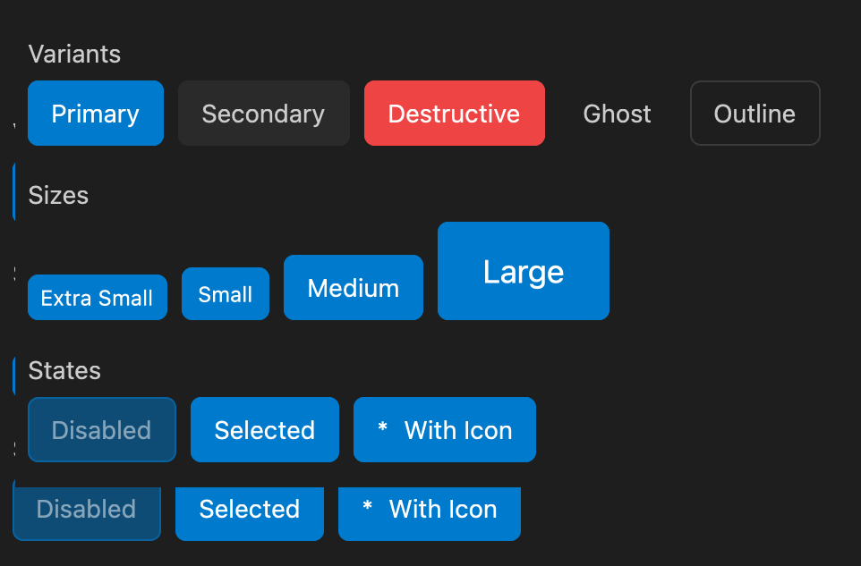 | 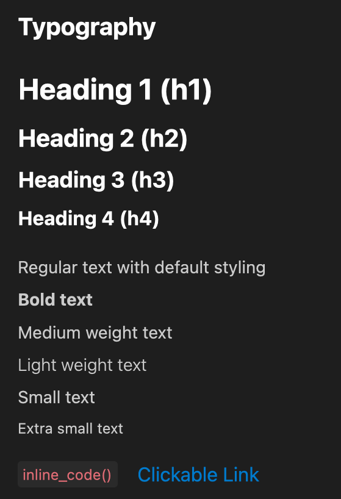 |
| Badges | Avatars |
| 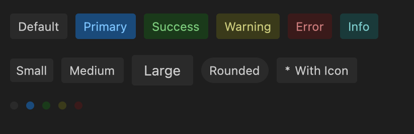 | 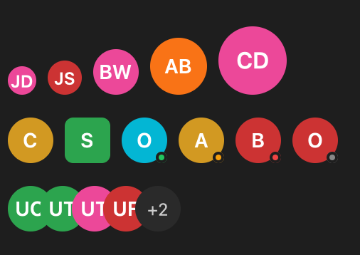 |
| Inputs | Progress |
| 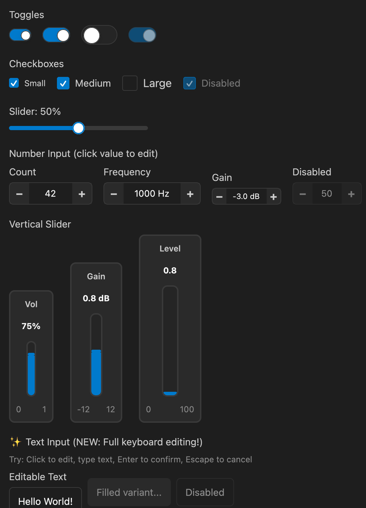 | 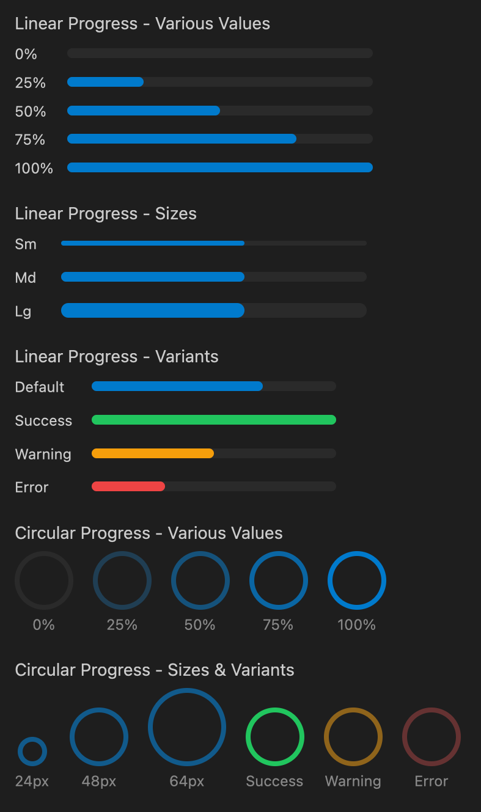 |
| Alerts |  |
| 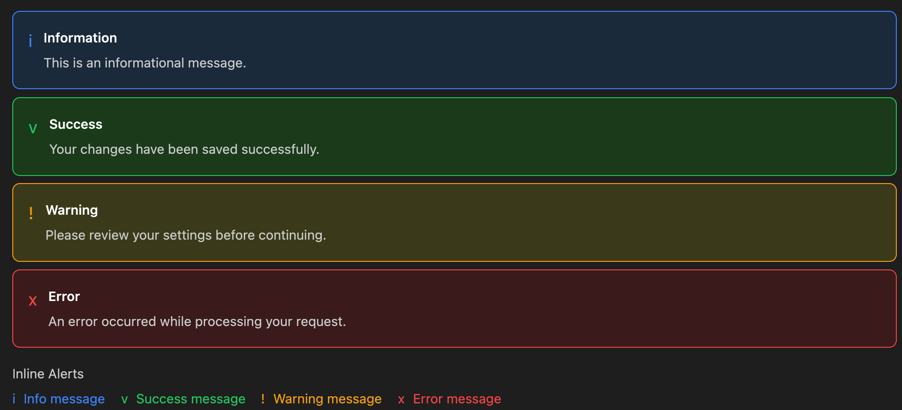 | 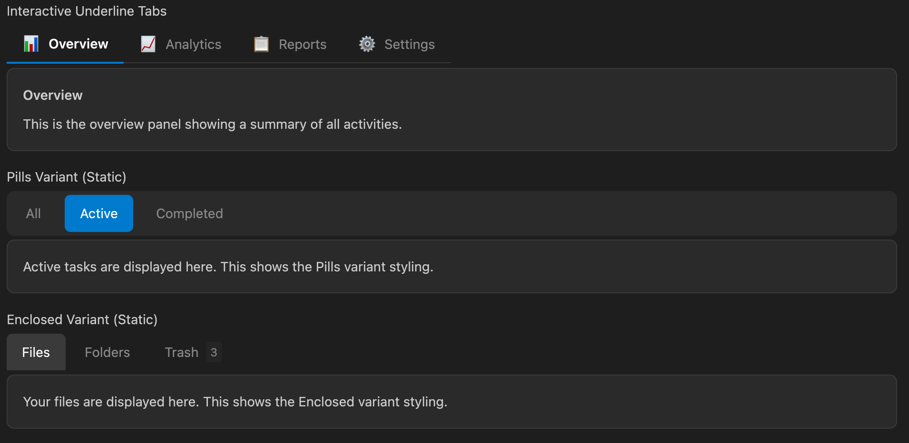 |
| Tabs | Layouts |
| 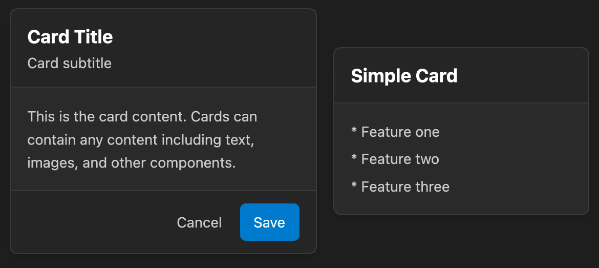 | 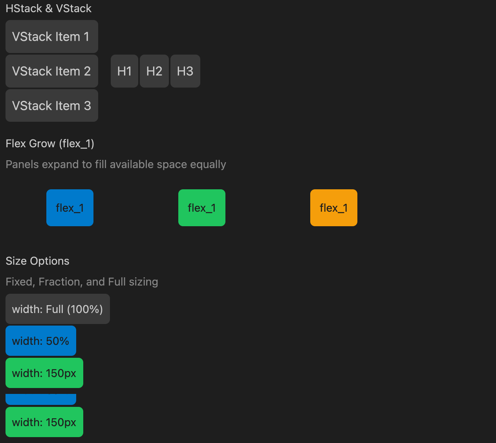 |
| Menus |  |
| 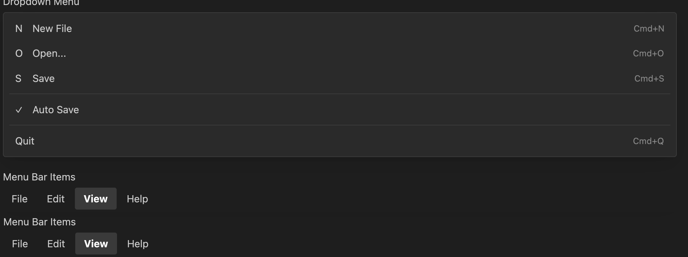 |  |
| Wizard | Workflow |
| 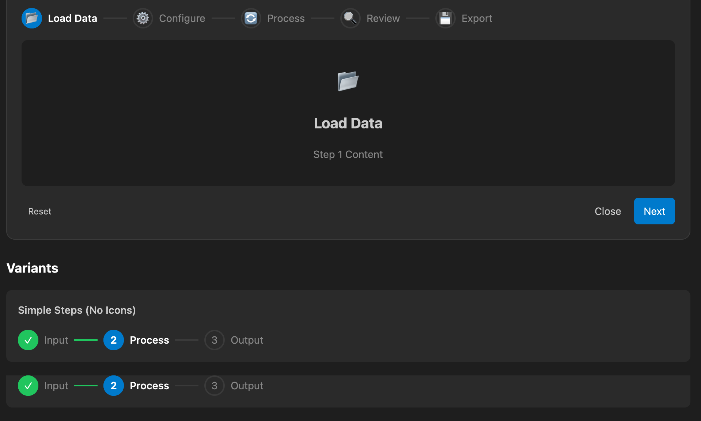 | 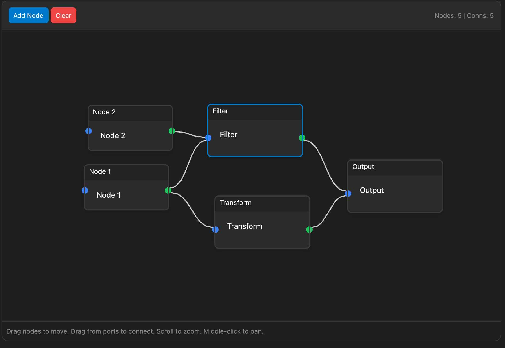 |


## Adding a New Component

This section is a step-by-step checklist for adding a new component to gpui-ui-kit. Follow every step to ensure consistency with the existing library.

### Checklist

- [ ] **1. Create the component source** (`src/<component>.rs`)
- [ ] **2. Register the module** in `src/lib.rs`
- [ ] **3. Add i18n translation keys** in `src/i18n.rs`
- [ ] **4. Write unit tests** in `tests/components/<component>_test.rs`
- [ ] **5. Write integration tests** in `tests/integration/<component>_test.rs`
- [ ] **6. Add a debug example** in `examples/<component>_debug.rs`
- [ ] **7. Add a showcase section** in `examples/includes/render_<component>.inc.rs`
- [ ] **8. Register in the showcase** in `examples/showcase.rs`
- [ ] **9. Update documentation** (this README + component tables)
- [ ] **10. Verify** everything compiles and all tests pass

### Step 1: Create the Component Source

Create `src/<component>.rs`. Follow these conventions:

- Use the **builder pattern** with setter methods returning `Self`
- Use the `FormField` derive macro for form components to reduce boilerplate
- Use `IntoElement` for rendering (implement `RenderOnce` or `Render`)
- Support optional `ComponentTheme` for per-instance theme overrides
- Keep event handler closures as `Option<Box<dyn Fn(...)>>`

```rust
// src/my_widget.rs
use gpui::*;

#[derive(Clone, Copy, Debug, Default, PartialEq, Eq)]
pub enum MyWidgetVariant {
    #[default]
    Default,
    Primary,
}

#[derive(Clone, Copy, Debug, Default, PartialEq, Eq)]
pub enum MyWidgetSize {
    Sm,
    #[default]
    Md,
    Lg,
}

pub struct MyWidget {
    id: ElementId,
    label: SharedString,
    variant: MyWidgetVariant,
    size: MyWidgetSize,
    disabled: bool,
    on_click: Option<Box<dyn Fn(&mut Window, &mut App) + 'static>>,
}

impl MyWidget {
    pub fn new(id: impl Into<ElementId>, label: impl Into<SharedString>) -> Self {
        Self {
            id: id.into(),
            label: label.into(),
            variant: MyWidgetVariant::Default,
            size: MyWidgetSize::Md,
            disabled: false,
            on_click: None,
        }
    }

    pub fn variant(mut self, variant: MyWidgetVariant) -> Self {
        self.variant = variant;
        self
    }

    pub fn size(mut self, size: MyWidgetSize) -> Self {
        self.size = size;
        self
    }

    pub fn disabled(mut self, disabled: bool) -> Self {
        self.disabled = disabled;
        self
    }

    pub fn on_click(mut self, handler: impl Fn(&mut Window, &mut App) + 'static) -> Self {
        self.on_click = Some(Box::new(handler));
        self
    }
}

impl RenderOnce for MyWidget {
    fn render(self, _window: &mut Window, cx: &mut App) -> impl IntoElement {
        let theme = cx.theme();
        // ... render using theme colors
        div().id(self.id).child(self.label.clone())
    }
}

impl IntoElement for MyWidget {
    type Element = <Self as RenderOnce>::Element;

    fn into_element(self) -> Self::Element {
        self.into_any_element()
    }
}
```

### Step 2: Register the Module

Add the module and re-exports in `src/lib.rs`:

```rust
// In the appropriate section of src/lib.rs:
pub mod my_widget;

// Re-export commonly used types:
pub use my_widget::{MyWidget, MyWidgetSize, MyWidgetVariant};
```

### Step 3: Add i18n Translation Keys

In `src/i18n.rs`:

1. Add a `TranslationKey` variant for the showcase section title:
   ```rust
   // In the TranslationKey enum, under "Section titles":
   SectionMyWidget,
   ```

2. Add translations in **all 5 language functions** (`add_english`, `add_french`, `add_german`, `add_spanish`, `add_japanese`):
   ```rust
   // In add_english():
   t.insert(TranslationKey::SectionMyWidget, "My Widget");
   // In add_french():
   t.insert(TranslationKey::SectionMyWidget, "Mon Widget");
   // In add_german():
   t.insert(TranslationKey::SectionMyWidget, "Mein Widget");
   // In add_spanish():
   t.insert(TranslationKey::SectionMyWidget, "Mi Widget");
   // In add_japanese():
   t.insert(TranslationKey::SectionMyWidget, "マイウィジェット");
   ```

3. Add any component-specific label keys the same way (e.g., `LabelMyWidgetEnabled`).

### Step 4: Write Unit Tests

Create `tests/components/my_widget_test.rs`:

```rust
//! MyWidget component tests

use gpui_ui_kit::my_widget::{MyWidget, MyWidgetSize, MyWidgetVariant};

#[test]
fn test_my_widget_creation() {
    let widget = MyWidget::new("test", "Label");
    let _ = widget;
}

#[test]
fn test_my_widget_variants() {
    let variants = [MyWidgetVariant::Default, MyWidgetVariant::Primary];
    for variant in &variants {
        let widget = MyWidget::new("test", "Label").variant(*variant);
        let _ = widget;
    }
}

#[test]
fn test_my_widget_sizes() {
    let sizes = [MyWidgetSize::Sm, MyWidgetSize::Md, MyWidgetSize::Lg];
    for size in &sizes {
        let widget = MyWidget::new("test", "Label").size(*size);
        let _ = widget;
    }
}

#[test]
fn test_my_widget_disabled() {
    let widget = MyWidget::new("test", "Label").disabled(true);
    let _ = widget;
}

#[test]
fn test_my_widget_with_click_handler() {
    let widget = MyWidget::new("test", "Label")
        .on_click(|_window, _cx| {});
    let _ = widget;
}

#[test]
fn test_my_widget_full_configuration() {
    let widget = MyWidget::new("test", "Label")
        .variant(MyWidgetVariant::Primary)
        .size(MyWidgetSize::Lg)
        .disabled(false)
        .on_click(|_window, _cx| {});
    let _ = widget;
}
```

Register in `tests/components/mod.rs`:
```rust
mod my_widget_test;
```

### Step 5: Write Integration Tests

Create `tests/integration/my_widget_test.rs`:

```rust
//! Integration tests for MyWidget component

use gpui::{Context, TestAppContext, Window, div, prelude::*};
use gpui_ui_kit::my_widget::{MyWidget, MyWidgetSize, MyWidgetVariant};

struct MyWidgetTestView;

impl Render for MyWidgetTestView {
    fn render(&mut self, _window: &mut Window, _cx: &mut Context<Self>) -> impl IntoElement {
        div().child(MyWidget::new("test", "Hello"))
    }
}

#[gpui::test]
async fn test_my_widget_renders(cx: &mut TestAppContext) {
    let _window = cx.add_window(|_window, _cx| MyWidgetTestView);
}

#[gpui::test]
async fn test_my_widget_all_variants(cx: &mut TestAppContext) {
    struct AllVariantsView;

    impl Render for AllVariantsView {
        fn render(&mut self, _window: &mut Window, _cx: &mut Context<Self>) -> impl IntoElement {
            div()
                .child(MyWidget::new("a", "Default").variant(MyWidgetVariant::Default))
                .child(MyWidget::new("b", "Primary").variant(MyWidgetVariant::Primary))
        }
    }

    let _window = cx.add_window(|_window, _cx| AllVariantsView);
}

#[gpui::test]
async fn test_my_widget_all_sizes(cx: &mut TestAppContext) {
    struct AllSizesView;

    impl Render for AllSizesView {
        fn render(&mut self, _window: &mut Window, _cx: &mut Context<Self>) -> impl IntoElement {
            div()
                .child(MyWidget::new("a", "Sm").size(MyWidgetSize::Sm))
                .child(MyWidget::new("b", "Md").size(MyWidgetSize::Md))
                .child(MyWidget::new("c", "Lg").size(MyWidgetSize::Lg))
        }
    }

    let _window = cx.add_window(|_window, _cx| AllSizesView);
}

#[gpui::test]
async fn test_my_widget_disabled(cx: &mut TestAppContext) {
    struct DisabledView;

    impl Render for DisabledView {
        fn render(&mut self, _window: &mut Window, _cx: &mut Context<Self>) -> impl IntoElement {
            div().child(MyWidget::new("test", "Disabled").disabled(true))
        }
    }

    let _window = cx.add_window(|_window, _cx| DisabledView);
}
```

Register in `tests/integration/mod.rs`:
```rust
mod my_widget_test;
```

### Step 6: Add a Debug Example

Create `examples/my_widget_debug.rs` for standalone testing:

```rust
use gpui::*;
use gpui_ui_kit::my_widget::{MyWidget, MyWidgetVariant};
use gpui_ui_kit::theme::ThemeExt;
use gpui_ui_kit::*;

struct MyWidgetDebugView;

impl Render for MyWidgetDebugView {
    fn render(&mut self, _window: &mut Window, cx: &mut Context<Self>) -> impl IntoElement {
        let theme = cx.theme();
        div()
            .size_full()
            .bg(theme.bg)
            .p_8()
            .flex()
            .flex_col()
            .gap_4()
            .child(MyWidget::new("default", "Default"))
            .child(MyWidget::new("primary", "Primary").variant(MyWidgetVariant::Primary))
            .child(MyWidget::new("disabled", "Disabled").disabled(true))
    }
}

fn main() {
    Application::new().run(|cx| {
        cx.open_window(
            WindowOptions {
                window_bounds: Some(WindowBounds::Windowed(Bounds::centered(
                    None, size(px(400.0), px(300.0)), cx,
                ))),
                ..Default::default()
            },
            |_window, _cx| MyWidgetDebugView,
        )
        .unwrap();
    });
}
```

Register in `Cargo.toml` under `[[example]]`:
```toml
[[example]]
name = "my_widget_debug"
```

### Step 7: Add a Showcase Section

Create `examples/includes/render_my_widget.inc.rs`:

```rust
impl Showcase {
    fn render_my_widget_section(&self, cx: &mut Context<Self>) -> impl IntoElement {
        let section_title = cx.t(TranslationKey::SectionMyWidget);

        VStack::new()
            .spacing(StackSpacing::Lg)
            .child(self.section_header(section_title))
            .child(
                HStack::new()
                    .spacing(StackSpacing::Md)
                    .child(MyWidget::new("default", "Default").variant(MyWidgetVariant::Default))
                    .child(MyWidget::new("primary", "Primary").variant(MyWidgetVariant::Primary)),
            )
            .child(
                HStack::new()
                    .spacing(StackSpacing::Md)
                    .child(MyWidget::new("sm", "Small").size(MyWidgetSize::Sm))
                    .child(MyWidget::new("md", "Medium").size(MyWidgetSize::Md))
                    .child(MyWidget::new("lg", "Large").size(MyWidgetSize::Lg)),
            )
    }
}
```

### Step 8: Register in the Showcase

In `examples/showcase.rs`:

1. Add variant to `ShowcaseSection` enum:
   ```rust
   pub enum ShowcaseSection {
       // ... existing variants
       MyWidget,
   }
   ```

2. Add to `ShowcaseSection::all()`:
   ```rust
   ShowcaseSection::MyWidget,
   ```

3. Add the `include!` for the render file:
   ```rust
   include!("includes/render_my_widget.inc.rs");
   ```

4. Add the navigation entry with icon and translation key.

5. Add the match arm in the `render_content` method:
   ```rust
   ShowcaseSection::MyWidget => self.render_my_widget_section(cx).into_any_element(),
   ```

### Step 9: Update Documentation

1. Add the component to the appropriate table in **this README** (Core/Form/Data Display/etc.)
2. Add a **Usage Example** code block showing the API
3. Update the **Test Coverage** numbers

### Step 10: Verify

```bash
# Check compilation
cargo check -p gpui-ui-kit --all-targets

# Run clippy
cargo clippy -p gpui-ui-kit --all-targets

# Run all tests
cargo test -p gpui-ui-kit --lib --tests

# Run the showcase to visually verify
cargo run --example showcase -p gpui-ui-kit --release

# Format
cargo fmt -p gpui-ui-kit
```

### File Summary

| What | Where |
|------|-------|
| Component source | `src/<component>.rs` |
| Module registration | `src/lib.rs` |
| Translation keys | `src/i18n.rs` (all 5 languages) |
| Unit tests | `tests/components/<component>_test.rs` + `tests/components/mod.rs` |
| Integration tests | `tests/integration/<component>_test.rs` + `tests/integration/mod.rs` |
| Debug example | `examples/<component>_debug.rs` + `Cargo.toml` |
| Showcase section | `examples/includes/render_<component>.inc.rs` |
| Showcase registration | `examples/showcase.rs` (enum + all() + include + render match) |
| README entry | Component table + usage example |

## License

Permissive [ISC License](https://en.wikipedia.org/wiki/ISC_license)
