# Systemwide Architecture

This document reviews the current `crates/systemwide` architecture and records a
direction for making state ownership clearer and the system easier to debug
without installing the macOS HAL package for every test cycle.

## Maintenance Policy

`ARCHITECTURE.md` is a maintained project document, not a one-time review
artifact. Keep it current with the same discipline as the systemwide `README`
and project changelog.

Update this document whenever a change affects:

- component responsibilities or process boundaries;
- state ownership, desired/applied state, or shared-memory protocol fields;
- user-visible runtime flows such as startup, playback, plugin loading, key
  rotation, device recovery, installation, or upgrades;
- debugging, test strategy, or manual recovery procedures;
- safety invariants around CoreAudio, real-time callbacks, physical output
  device selection, encryption, or installer lifecycle.

## Scope

`systemwide` is the SOTF subsystem that captures operating-system audio,
processes it through the SOTF plugin engine, and sends the processed signal to a
physical output device. On macOS the capture side is a CoreAudio HAL virtual
device. Other platforms currently fall back to a `NullDriver` while keeping the
same daemon-facing driver abstraction.

The current code is split into four major surfaces:

| Component | Location | Responsibility |
| --- | --- | --- |
| Configbar toolbar | `crates/daemon/configbar/src/*.swift` | macOS menu bar app, daemon lifecycle, user commands, plugin rack UI, metering UI, hardware-device recovery polling, menu bar status icon |
| Daemon | `crates/daemon/bin/sotf_daemon.rs` | IPC server, command authorization, playback lifecycle, plugin-chain orchestration, output device choice, encryption commands |
| Driver abstraction | `crates/driver-common/src/lib.rs` | Cross-platform `AudioDriver` trait, `DriverStatus`, `DriverConfig`, `ConfigResult`, `NullDriver` fallback |
| macOS HAL bridge | `crates/driver-hal/src/*`, `crates/driver-hal/swift/Sources/*` | Shared-memory protocol, encrypted audio records, CoreAudio HAL driver implementation, Rust `HalDriver` adapter |
| Installer scripts | `scripts/build-systemwide.sh` | App bundle, package/DMG build, running-system quiesce, HAL driver replacement, stale runtime cleanup |

The daemon also depends on the workspace audio engine and plugin stack:
`sotf_audio::manager::AudioEngineManager`, `sotf-engine`, and `sotf-plugins`.

## Component View

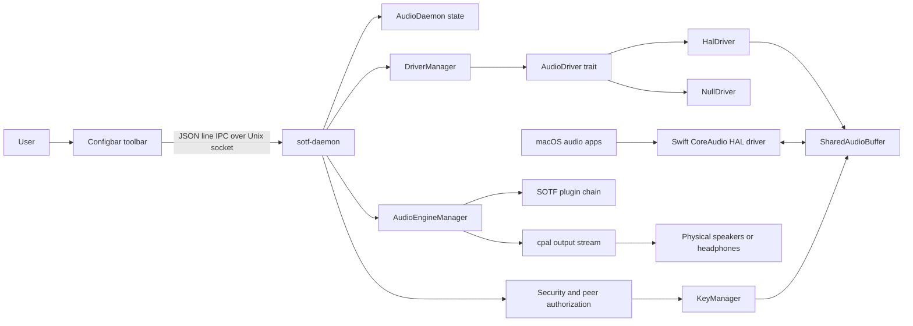

## Static Structure

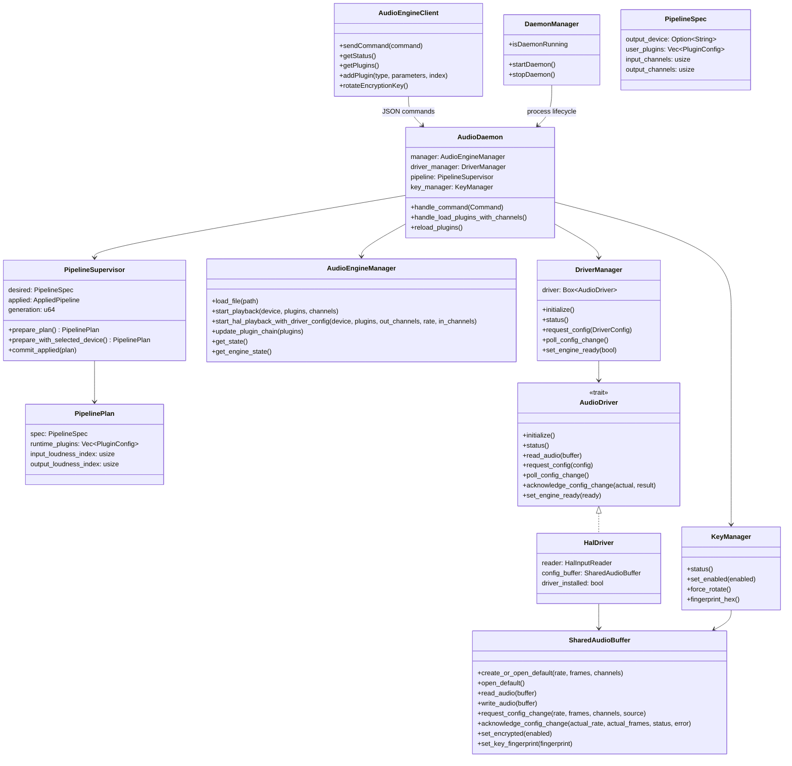

## Runtime Boundaries

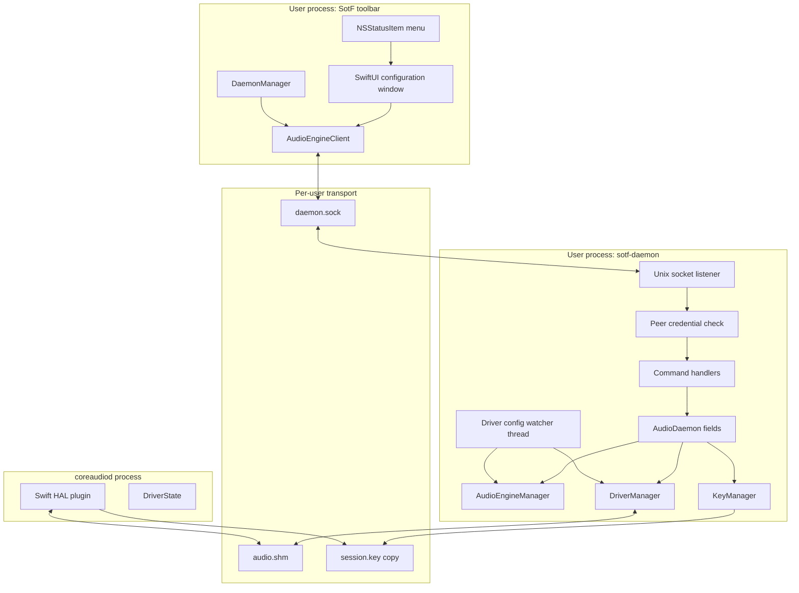

## IPC Model

The daemon exposes one JSON object per line on a Unix domain socket. The secure
path is per-user, with a legacy `/tmp/autoeq_audio.sock` opt-in path still
supported for compatibility. The daemon verifies peer credentials and classifies
callers:

| Peer class | Access |
| --- | --- |
| Owner or root | All commands |
| macOS `_coreaudiod` | Status/config/encryption visibility only |

The command enum currently covers:

- Playback: `load`, `play`, `pause`, `stop`, `seek`, `set_volume`.
- Device and driver config: `list_devices`, `set_device`, `driver_status`,
  `set_sample_rate`, `set_buffer_frames`, `get_driver_config`.
- Plugin chain: `load_plugins`, `get_plugins`, `get_available_plugins`,
  `add_plugin`, `remove_plugin`, `update_plugin`, `reorder_plugins`.
- Metering: `get_loudness`, `get_metering`.
- Encryption: `set_encryption`, `encryption_status`,
  `rotate_encryption_key`.
- Lifecycle: `status`, `shutdown`.

## Current State Ownership Review

The first control point added by this branch is `PipelineSupervisor`. It is the
daemon-owned state owner for the user-facing audio graph: selected physical
output device, user plugin list, requested HAL input channels, requested output
channels, applied runtime chain generation, and the metering tap indices derived
from that applied runtime chain.

The important distinction is desired versus applied state:

- `PipelineSpec` is what the daemon wants next.
- `PipelinePlan` is a validated, derived transition: user plugins sanitized,
  loudness monitors injected, channel counts checked, and output device filtered.
- `AppliedPipeline` is committed only after the engine accepts the transition.

This removes the previous independent daemon mutexes for `selected_device`,
`current_plugins`, channel counts, and meter indices.

| State | Current owner or cache | Notes |
| --- | --- | --- |
| Playback engine state, volume, mute, plugin runtime | `AudioEngineManager` | Authoritative for the actual engine stream and cached plugin data. |
| Desired user plugin list | `PipelineSupervisor.desired.user_plugins` | User plugins only; daemon injects input/output loudness monitors when building a `PipelinePlan`. |
| Runtime plugin chain | `PipelinePlan.runtime_plugins`, then `AudioEngineManager` | Derived from desired state and committed to `AppliedPipeline` only after the engine accepts it. |
| Output device selection | `PipelineSupervisor.desired.output_device`, `ConfigurationView.selectedDevice` | Toolbar stores a UI cache; daemon stores and validates the authoritative desired output device. |
| Driver status/config | `DriverManager`, `HalDriver.config_buffer`, shared-memory header, Swift HAL `DriverState` | Status and config are protocol state in shared memory plus local state on both Rust and Swift sides. |
| Input/output channel counts | `PipelineSupervisor.desired`, shared-memory header, toolbar `@State` | Daemon desired channel counts now have one owner; shared memory reports negotiated transport state. |
| Metering indices | `AppliedPipeline.input_loudness_index`, `AppliedPipeline.output_loudness_index`, `AudioEngineManager` plugin cache | Derived from the applied plugin chain and no longer independently mutable. |
| Encryption enabled/fingerprint | `KeyManager`, shared-memory header, Swift toolbar cache, HAL reader/writer cached cipher | `KeyManager` owns the desired key state; shared memory publishes the active transport state. |
| Daemon process lifecycle | Toolbar `DaemonManager`, daemon `running` flag | Toolbar owns the child process it started; daemon owns its accept-loop shutdown flag. |

The remaining architectural smell is that command handlers still directly
orchestrate several effects: driver config, engine restart/hot update, shared
memory encryption sync, and response building. `PipelineSupervisor` is a first
state-owner step, not yet the full controller/reducer boundary.

### State Mutation Audit

Recent live failures were all state-control failures, not isolated DSP bugs:

- The toolbar cached channel counts and could send stale `input_channels` back
  through `load_plugins`, overwriting daemon-negotiated HAL input channels.
- HAL readiness used `engine_ready` plus `daemon_heartbeat_ms`; when the daemon
  stopped refreshing the heartbeat while idle, HAL accepted a later playback
  client but refused to write frames to shared memory.
- Encryption key rotation changed the shared-memory fingerprint while HAL
  reader/writer ciphers were cached, so audio could be present but decode to
  silence until ciphers reloaded.
- The daemon status could report `Playing` while `playback_callback_count` and
  frame counters stayed at zero; the UI did not surface that contradiction as a
  distinct pipeline fault.
- A feedback-loop symptom can occur whenever the physical output sink is not
  controlled as a hardware-only selection distinct from the virtual system
  output.

The current controls are better than the original code, but still incomplete:

| Area | Current mutation path | Missing control |
| --- | --- | --- |
| Desired audio graph | `PipelineSupervisor.prepare_plan()` and `commit_applied()` own normal plugin/channel/device changes | `spawn_initial_driver_playback()` and idle driver reconfigure still reach into `desired` directly. Add explicit reducer methods such as `set_desired_output_device()` and `commit_idle_reconfigure()` so all desired mutations pass through one API. |
| Toolbar configuration | Swift `@State` mirrors daemon selected device, input channels, output channels, encryption, and device lists | The UI can still initiate commands from local caches. Move configuration commands to patch-style intents: "set output channels to N", "load this plugin artifact", "set selected device to X"; daemon fills omitted canonical fields from `SystemwideState`. |
| Driver/HAL transport | `DriverManager` and `SharedAudioBuffer` publish active format, config handshake, readiness, heartbeat, and encryption fingerprint | Shared memory remains both transport and tempting state source. Only `DriverManager`/`HalDriver` should write protocol fields; higher layers should read them through typed status snapshots. |
| Runtime engine | `AudioEngineManager` owns playback state, stream counters, plugin runtime, volume, mute, and cached plugin data | Command handlers still stop/restart the engine while holding or acquiring other state locks. Move multi-step transitions into one controller with one lock-order policy and rollback/diagnostic output. |
| Metering | Loudness monitor indices are derived from `AppliedPipeline`; data comes from engine plugin cache | `get_metering` can return correctly shaped zeros without saying whether this is "no audio", "no analyzer data yet", "stale plugin index", or "engine not receiving frames". Add metering provenance/status fields. |
| Encryption | `KeyManager` owns desired key state; shared memory publishes active fingerprint; readers/writers cache ciphers | Key rotation must be treated as a protocol transition with observable state: requested fingerprint, published fingerprint, reader/writer reload status, and last reload error. |
| Device discovery | Daemon lists CPAL devices; toolbar also queries CoreAudio directly for UI details | Two enumerators can disagree after CoreAudio churn. Daemon should publish the authoritative device snapshot and a timestamp/error; toolbar-only enumeration should be advisory UI metadata. |

The control rule for future changes:

1. User actions become typed intents.
2. The daemon controller validates each intent against one desired-state model.
3. Runtime adapters apply the transition and return observed results.
4. Desired state is committed only through controller/reducer methods.
5. The UI renders daemon snapshots and never repairs daemon state by resending
   locally cached fields.

Implemented first controls:

- `PipelineSupervisor` now exposes reducer-style methods for startup output
  device adoption and idle HAL reconfiguration. Startup and idle config-change
  paths no longer write `desired` directly from outside the supervisor.
- The daemon exposes read-only `get_snapshot` and `dump_state` commands. The
  snapshot separates desired pipeline state, applied pipeline state, observed
  engine/driver/encryption state, metering provenance, and diagnostics.
- `get_metering` remains backward-compatible (`input` and `output` are still at
  the top level) and now includes `sources.input` / `sources.output` so shaped
  zero arrays are distinguishable from real loudness-monitor data.
- Snapshot diagnostics currently flag important contradictions such as
  `Playing` with no input frames, no output callbacks, no resolved output
  device, inactive HAL stream, or unsafe virtual/loopback output devices.

## Use Case: User Starts The Toolbar

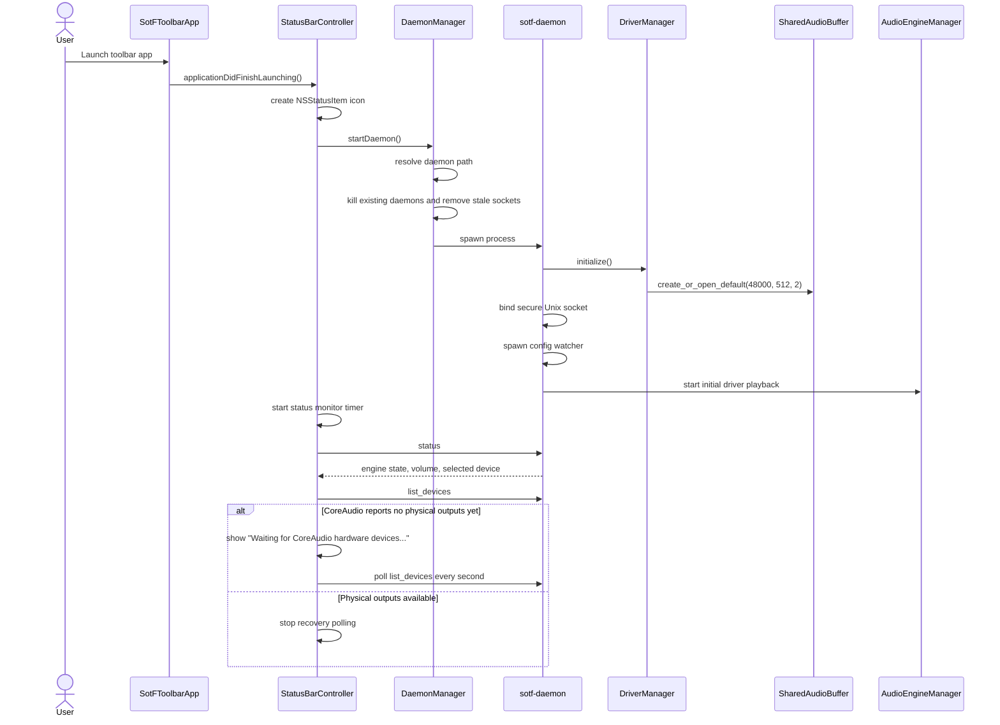

Key observations:

- Toolbar startup owns process supervision today.
- Daemon startup owns driver initialization and initial playback.
- The toolbar can only infer readiness by polling IPC responses.
- If CoreAudio is still recovering after install/restart, the toolbar treats an
  empty physical-output list as a transient recovery state and polls until
  hardware devices reappear.
- The menu bar icon is a status signal: startup/idle is explicitly dark,
  active playback is white, and errors are red.

## Use Case: User Plays Music

There are two related "play" paths.

The file playback path is explicit:

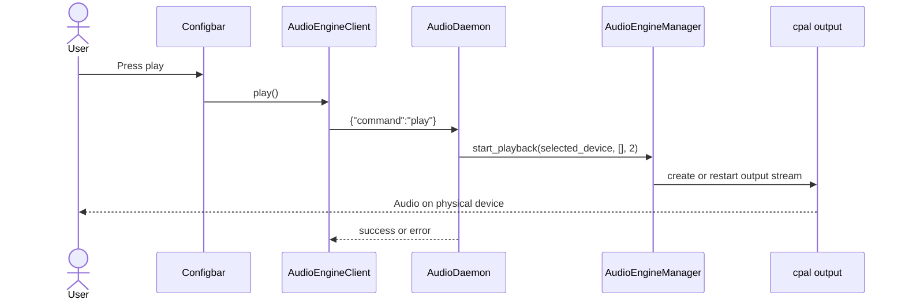

The systemwide path is usually active after startup or after `load_plugins`:

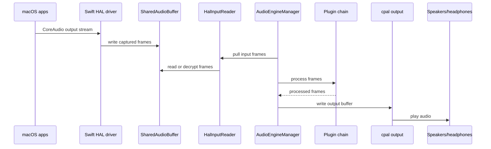

Key observations:

- The user-facing "play music" action may happen outside SOTF by playing audio
  in another macOS app.
- In systemwide mode, `engine_ready` in shared memory gates whether the HAL side
  should feed audio to the daemon.
- While `engine_ready=true`, the daemon-owned `HalDriver` keeps
  `daemon_heartbeat_ms` fresh independently of audio reads. This avoids an
  idle-start deadlock where HAL accepts a later playback client but refuses to
  write frames because the daemon heartbeat expired before the first audio
  arrived.
- Output device safety is enforced by rejecting virtual/loopback device names
  for the physical output side.

## Use Case: User Adds A Plugin

```mermaid
sequenceDiagram
    actor User
    participant Rack as PluginRackView
    participant Client as AudioEngineClient
    participant Daemon as AudioDaemon
    participant Pipeline as PipelineSupervisor
    participant Engine as AudioEngineManager

    User->>Rack: Choose plugin in AddPluginSheet
    Rack->>Client: addPlugin(type, parameters, nil)
    Client->>Daemon: {"command":"add_plugin", ...}
    Daemon->>Pipeline: clone desired plugins and prepare_plan()
    Pipeline-->>Daemon: PipelinePlan
    Note over Pipeline: sanitize user plugins + inject input/output loudness monitors
    Daemon->>Engine: update_plugin_chain(plan.runtime_plugins)
    alt Engine is running
        Engine-->>Daemon: hot update ok
        Daemon->>Pipeline: commit_applied(plan)
    else No engine running
        Daemon->>Engine: start_hal_playback_with_driver_config(...)
        Engine-->>Daemon: start ok
        Daemon->>Pipeline: commit_applied(plan)
    else Engine rejects transition
        Note over Daemon,Pipeline: no commit; desired/applied state unchanged
    end
    Daemon-->>Client: success or error
    Rack->>Client: getPlugins()
    Client->>Daemon: {"command":"get_plugins"}
    Daemon-->>Rack: user plugin list only
```

Key observations:

- The daemon is the source of truth for the desired user plugin list.
- The plugin rack keeps a local SwiftUI cache for rendering and editing.
- Metering plugins are derived system plugins, not user plugins.

## Use Case: User Rotates The Encryption Key

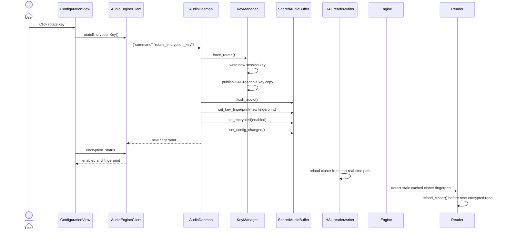

Key observations:

- `KeyManager` owns the session key.
- Shared memory publishes only transport metadata: encryption enabled flag and
  key fingerprint.
- HAL input/output readers cache ciphers and intentionally avoid filesystem I/O
  on audio callbacks.
- The daemon-side decoder checks `HalInputReader.needs_cipher_reload()` before
  reading encrypted HAL input. When the shared-memory fingerprint changes, it
  calls `reload_cipher()` from the decoder control path before `read()`, so key
  rotation or startup races do not strand the pipeline in a "playing but silent"
  state.
- If cipher reload fails, encrypted reads remain silent rather than emitting
  unauthenticated audio; retry is throttled to avoid filesystem work on the hot
  path.

## Use Case: Driver Reconfiguration

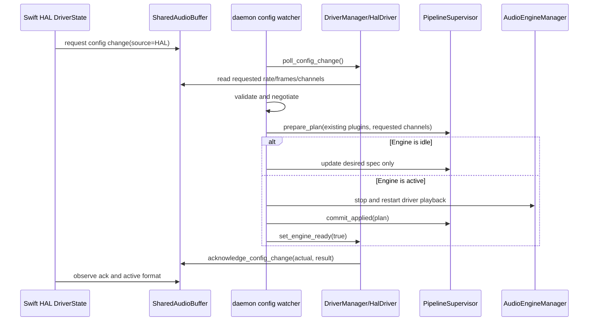

The reverse path also exists: daemon commands such as `set_sample_rate`,
`set_buffer_frames`, or `load_plugins` can call `DriverManager.request_config`,
which writes daemon-originated config requests into shared memory and waits for
the HAL side to acknowledge them.

## Installation And Upgrade Lifecycle

The installer must assume an older systemwide version may already be active.
Replacing the app bundle or HAL driver while the toolbar, daemon, or CoreAudio
helper still hold runtime state can leave stale sockets, shared memory, or
session keys behind and can make the next launch appear healthy while no audio
flows.

The current package and standalone HAL installer lifecycle is:

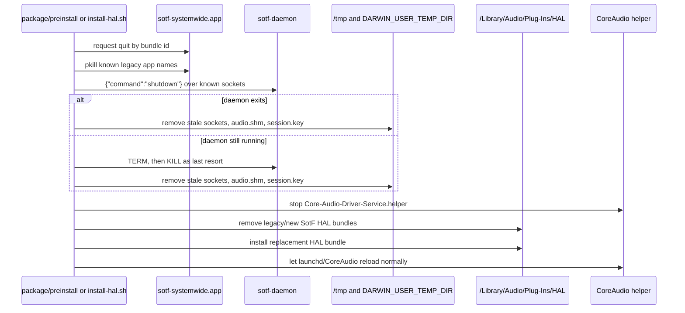

Important details:

- The installer does not rely on `launchctl kickstart` for `coreaudiod`; that
  is restricted on modern macOS.
- Runtime cleanup targets the secure daemon socket, legacy socket, `audio.shm`,
  and HAL-readable `session.key` copy.
- The toolbar should show a transient hardware-device recovery state after
  CoreAudio restarts instead of permanently selecting "no hardware devices".

## Architecture Improvement Proposals

### 1. Introduce A Single Daemon State Owner

`PipelineSupervisor` now owns the audio pipeline subset of daemon state. The
next step is to lift the same idea into a broader `SystemwideController` that
owns all desired daemon state and serializes effects:

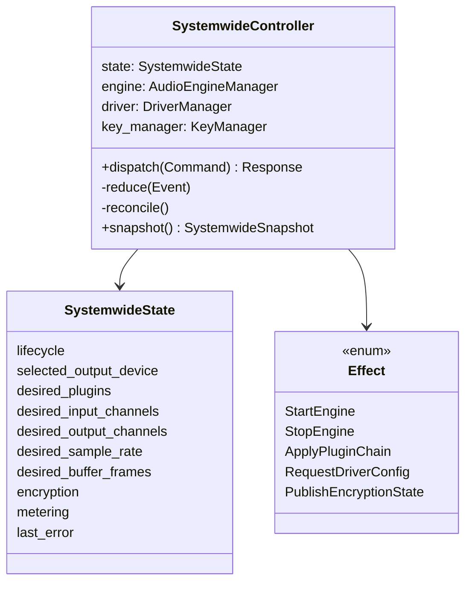

The controller would be the only writer of desired daemon state. IPC handlers
would become small command adapters:

1. Validate and authorize the command.
2. Convert the command into a domain event.
3. Let the controller update `SystemwideState`.
4. Let the controller run effects against the engine, driver, and shared memory.
5. Return a snapshot or command result.

The controller would replace the remaining effect-heavy command handlers with
one state owner and a smaller number of effect locks.

### 2. Separate Desired State From Observed Runtime State

Use two explicit data models:

| Model | Owner | Examples |
| --- | --- | --- |
| Desired state | Daemon controller | Selected output device, user plugin list, requested sample rate, requested channels, encryption enabled |
| Observed state | Runtime adapters | Actual engine state, driver readiness, HAL active format, underruns, metering values |

The daemon should publish one `SystemwideSnapshot` that combines both models for
the UI. The toolbar should render that snapshot rather than maintaining its own
parallel interpretation of the daemon state.

### 3. Make Derived State Non-Authoritative

These values should be recomputed from the canonical state whenever needed:

- Final runtime plugin chain with injected monitors.
- Input/output loudness monitor indices.
- Channel compatibility warnings.
- HAL `ready` booleans derived from status fields.

Derived values can be cached for performance, but the cache should have one
clear invalidation path and should never be separately user-editable.

### 4. Separate Linear Racks From DSP Graphs

The systemwide toolbar currently loads whole-chain plugin configs into the same
linear `load_plugins` command used by the rack. It accepts simple engine plugin
arrays, app-GPUI-style `plugins` arrays, and RoomEQ-style `global_plugins` plus
per-channel `channels`, but the RoomEQ shape is flattened into one linear list.
That is acceptable for rack-compatible chains, but it is not a faithful model
for complex DSP graphs with branches, buses, per-channel subgraphs, fan-in,
fan-out, or routing metadata.

Recommended rule:

- The rack is an editor for simple ordered plugin chains.
- Complex DSP exports should remain graph artifacts with explicit topology,
  channel roles, buses, routes, and render hints.
- The daemon should eventually accept a `load_graph` or `load_pipeline_artifact`
  command beside `load_plugins`.
- The toolbar can render an imported graph as a read-only graph summary or
  dedicated graph view instead of forcing it into a rack.
- Editing a graph should happen through graph-aware operations; editing it as a
  flattened rack should require an explicit destructive conversion.

### 5. Make Shared Memory A Transport, Not A State Store

`SharedAudioBuffer` is the correct owner of the cross-process memory protocol,
but it should not be treated as the product state owner. The daemon state should
own the desired config; shared memory should publish the protocol fields needed
by HAL and the daemon to exchange audio and acknowledgements.

Recommended rule:

- Daemon controller owns desired audio graph and driver configuration.
- HAL driver owns CoreAudio object lifecycle and current CoreAudio callback
  constraints.
- Shared memory owns only transport state: ring positions, format handshake
  fields, readiness flags, encryption fingerprint, and heartbeat.
- The daemon-side HAL adapter owns heartbeat publication. Audio reads may also
  refresh the heartbeat, but liveness must not depend on audio already flowing.

### 6. Replace Polling-Oriented UI With Snapshot Plus Events

The toolbar currently polls status and metering and separately refreshes plugins.
Keep polling where it is cheap and real-time enough for meters, but add a
single `get_snapshot` command for configuration state:

```json
{
  "command": "get_snapshot"
}
```

The response should include daemon lifecycle, selected output device, desired
plugins, available driver format, encryption status, and last errors. Later,
this can become a subscription/event stream over the same Unix socket.

### 7. Add Correlation IDs To Commands And Logs

Every command should carry or receive a generated `command_id`. The same ID
should appear in toolbar logs, daemon logs, driver config acknowledgements, and
state snapshots. This makes it possible to trace "user clicked add plugin" all
the way to "engine hot-updated plugin chain" without guessing from timestamps.

## Debugging Without Installing And Manual Testing

The current system is hard to validate because the full path normally requires:

1. Installing a HAL driver bundle in `/Library/Audio/Plug-Ins/HAL`.
2. Restarting or persuading CoreAudio to load it.
3. Running the toolbar.
4. Producing real system audio.
5. Inspecting behavior manually.

The architecture should support a local, scriptable "systemwide lab" instead.

### Proposed Debug Harness

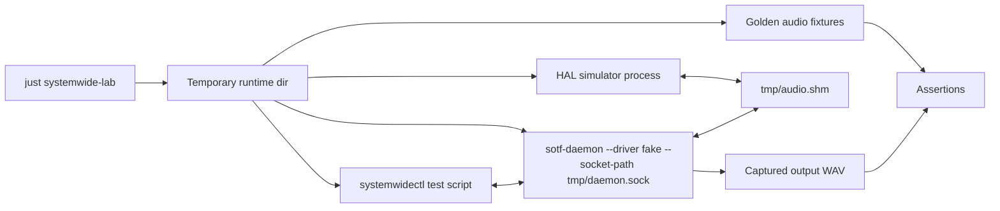

The harness should start all processes in a temporary directory and never write
to `/Library`, the real per-user daemon socket, or the real system audio output.

### Pieces To Add

| Piece | Purpose |
| --- | --- |
| `FakeAudioDriver` | Implements `AudioDriver` with deterministic sine/noise/multichannel fixtures and controllable config-change events. A first in-process fake driver now exists in daemon tests through `DriverManager::from_driver`. |
| HAL simulator | Opens `audio.shm`, writes/reads frames, toggles `driver_ready`, sends config changes, validates encryption fingerprints. Can be Rust or Swift command-line code. |
| `sotf-daemon --socket-path` | Lets tests bind to a temp socket instead of per-user or legacy paths. |
| `sotf-daemon --shared-memory-path` | Lets tests avoid `/tmp/sotf-{uid}/audio.shm`. |
| `sotf-daemon --no-autostart` | Starts IPC and driver status without starting initial playback, useful for command tests. |
| `systemwidectl` CLI | Sends JSON commands, waits for snapshots, dumps state, and records command/response traces. |
| `--capture-output path.wav` | Writes processed output to a file or in-memory sink instead of a physical cpal device. |
| Toolbar fake client tests | Run Swift UI/client logic against a fake Unix-socket daemon with golden responses. |
| Shared protocol tests | Keep Rust and Swift shared-memory header layouts, atomics, config handshakes, and encryption records in lockstep. |

### Recommended Test Pyramid

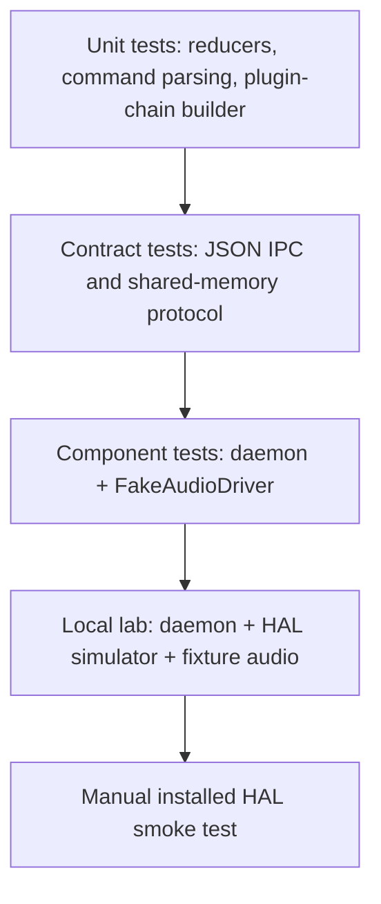

Manual installed-HAL testing should become the smallest layer. Most regressions
should be caught before a developer installs anything.

Current branch coverage starts the lower middle of that pyramid:

- `PipelineSupervisor` unit tests prove planning is pure, channel validation
  happens before mutation, and monitor indices are derived from the runtime
  chain.
- Fake-driver daemon tests prove `DriverManager` can be injected and driver
  status/config paths can be exercised without the installed HAL bundle.
- Unix-stream IPC tests send real JSON lines through `AudioDaemon::handle_client`
  and assert state is unchanged when an invalid channel-count transition is
  rejected.
- Snapshot IPC tests prove `get_snapshot` separates desired/observed state and
  exposes metering provenance; `dump_state` packages the snapshot with the user
  plugin list for doctor-style diagnostics.
- Reducer tests prove safe output-device adoption, virtual output-device
  rejection, and idle reconfiguration happen through `PipelineSupervisor`
  methods without committing an applied generation.

### Scenario Matrix

The E2E lab should be scenario-driven. Each scenario should start from a clean
temporary runtime directory, send commands over the real JSON socket, simulate
driver/HAL behavior through fakes, and assert snapshots plus captured audio.

| Scenario | Simulation | Assertions |
| --- | --- | --- |
| Idle start then first playback | Start daemon, set `engine_ready=true`, wait longer than the HAL heartbeat timeout, then have the HAL simulator write sine frames | `daemon_heartbeat_ms` stays fresh, frames received/written increase, input/output meters become non-zero, no manual restart needed. |
| No writer frames | Daemon starts playback but fake HAL reports active without writing frames | Snapshot marks `Playing` plus `input_frames=0` as `InputSilent` or equivalent, UI can display a transport fault instead of generic "No Audio". |
| Hardware output unavailable | Fake device inventory drops the selected device or returns no hardware outputs after startup | Desired selected device is preserved, observed output becomes unavailable, toolbar shows recovery/polling state, daemon never falls back to a virtual output. |
| Feedback-loop guard | Present `SotF Virtual Audio`, BlackHole, Loopback, and a hardware device; try selecting each as output sink | Virtual/loopback selections are rejected before engine restart; selected desired device remains the previous safe hardware device. |
| Channel-count negotiation | HAL simulator requests 2 -> 10 -> 2 input channels while an upmixer or matrix chain is loaded | Daemon desired input channels follow negotiated HAL input channels; toolbar adopts snapshot channels; stale UI apply cannot overwrite them. |
| Plugin load failure | Send invalid plugin/channel configs and graph-shaped configs that cannot be represented as a rack | Existing applied chain and metering indices remain unchanged; response explains whether the artifact is invalid or unsupported graph topology. |
| Complex DSP artifact | Load RoomEQ-style or graph-style artifact with branches/per-channel routes | Rack-compatible artifacts can be normalized; non-linear graphs are retained as graph artifacts or rejected without flattening silently. |
| Encryption rotation while playing | Enable encryption, stream known audio, rotate key, continue streaming | Published fingerprint changes, reader/writer reload from non-real-time paths, frame counters do not reuse `(key, nonce)`, meters recover without reinstall. |
| CoreAudio/helper restart | HAL simulator closes/reopens shared memory while daemon remains alive | Shared-memory geometry and readiness recover, desired daemon state is preserved, stale runtime transport state is not promoted to product state. |
| Meter analyzer unavailable | Engine runs but loudness plugin data is absent or plugin indices are stale | `get_metering` returns channel-shaped data plus provenance/status; UI can distinguish zero signal from unavailable analyzer. |

Each scenario should record:

- Command trace with correlation IDs.
- Snapshots before and after every command.
- Driver/HAL simulator events and shared-memory header diffs.
- Audio fixture hashes or RMS/peak summaries.
- Expected UI-facing fault category.

The first milestone is not perfect audio fidelity; it is making contradictions
machine-detectable. A test should fail if the daemon says `Playing` while all
ingress frame counters remain zero for more than a bounded grace period, or if a
toolbar command can mutate daemon-owned channel/device state using stale local
values.

### Useful Debug Commands

Add a `systemwide doctor` or `systemwidectl doctor` command that collects:

- Secure and legacy socket paths.
- Daemon PID and version.
- Current `SystemwideSnapshot`.
- Driver status and active shared-memory header fields.
- Plugin chain and derived runtime chain.
- Last N command traces with correlation IDs.
- Last N daemon log lines.
- Whether the configured output device appears to be physical or virtual.

This gives a single bug-report artifact without requiring a live screen-share or
manual reproduction notes.

### No-Sound Diagnostic Checklist

When the user reports "music is progressing but no sound", diagnose the live
pipeline from the outside in before changing code:

1. Confirm CoreAudio can enumerate hardware devices:
   `system_profiler SPAudioDataType` should list at least one real output.
   If it returns no devices, the problem is below the toolbar/daemon layer.
2. Confirm the daemon is reachable on the secure socket and inspect `status`.
   The important fields are `state`, `selected_device`,
   `pipeline_applied_output_device`, `playback_output_device`,
   `playback_frames_received`, `playback_frames_written`,
   `playback_stream_error_count`, and `last_error`.
3. Confirm `list_devices` marks `SotF Virtual Audio` as the system default
   output while the daemon-selected output is a physical device.
4. Confirm `get_hal_config` reports `driver_installed=true`,
   `driver_ready=true`, `active=true`, and the expected sample rate, buffer
   size, and channel count.
5. Confirm `get_metering` has non-zero input/output peaks while music is
   playing. If status frames increase but metering is zero, the silence is
   before or inside the daemon processing path, not at the hardware sink.
6. Confirm encryption state and fingerprints. A stale HAL input cipher can make
   encrypted reads return silence while status still reports frames. The
   current decoder reloads stale ciphers before reading; if diagnosing an older
   install, temporarily sending `set_encryption=false` can distinguish key
   mismatch from routing or hardware problems.
7. Check recent logs for `org.spinorama.sotf-hal`, `coreaudiod`, and
   `sotf-daemon`, especially `SharedMemory state`, `Loaded encryption key`,
   `HAL input cipher reload failed`, and CoreAudio `IO_Sender` resync floods.

The 2026-05-27 live failure followed this pattern: `status` showed `Playing`,
ADAM Audio D3V selected, and frames received/written, but `get_metering` was
zero. Disabling encryption immediately restored non-zero meters, proving the
root cause was an encrypted HAL key/cipher mismatch rather than CoreAudio device
enumeration or output-device selection.

## Proposed Migration Plan

1. Add read-only `get_snapshot` and `dump_state` commands around the current
   implementation. Done for the daemon JSON IPC path.
2. Introduce `SystemwideState` plus reducer-style methods for every desired
   mutation; remove direct writes to `PipelineSupervisor.desired`.
3. Convert IPC handlers to typed intents dispatched to a `SystemwideController`.
4. Extract plugin-chain/artifact planning into a pure module with unit tests,
   including explicit "rack chain" versus "graph artifact" outcomes.
5. Make metering and transport faults first-class snapshot fields rather than
   inferred UI labels.
6. Add `FakeAudioDriver`, HAL simulator, temp socket/shared-memory path
   overrides, and output capture.
7. Build `just systemwide-lab` around the scenario matrix and make it run in CI
   on macOS without installing the HAL bundle.
8. Move the toolbar to consume snapshots and send typed intents instead of
   reconstructing state from multiple commands.

## Invariants To Preserve

- No filesystem I/O, allocations, or logging-heavy work on CoreAudio real-time
  callbacks.
- The daemon must never choose the SOTF virtual device, BlackHole, Loopback,
  Soundflower, or similar virtual devices as the physical output sink.
- Cross-process shared-memory fields must remain atomic and versioned.
- Encryption key rotation must not reuse `(key, frame_counter)` pairs.
- Encryption key changes must not require manual reinstall/restart recovery;
  stale cached ciphers must be detected and reloaded from non-real-time paths.
- The daemon must maintain lock ordering or remove the need for multi-lock
  operations through a single controller.
- No component may mutate another component's desired state by replaying a
  cached copy. Commands either patch one field or submit a complete artifact
  with an explicit generation/base snapshot.
- A state transition that changes graph, channel count, output sink, HAL
  readiness, or encryption must produce one observable snapshot delta and one
  command trace entry.
- `Playing` with no input frames, no output callbacks, stale heartbeat, missing
  hardware output, or unavailable metering analyzer must be represented as
  distinct diagnostic states.
- `_coreaudiod` must remain restricted to the minimum command set.
- `ARCHITECTURE.md` must be updated alongside README/changelog changes whenever
  architecture, operational behavior, debugging strategy, or state ownership
  changes.

## Summary

The existing architecture has a sensible boundary between toolbar, daemon,
driver abstraction, HAL bridge, and audio engine. The main improvement is not to
split it into more services; it is to make the daemon's desired state explicit
and singly owned. Once the daemon can expose a coherent snapshot and run against
fake drivers/transports, most systemwide behavior can be debugged and tested
locally without installing the HAL driver or relying on manual audio tests.
